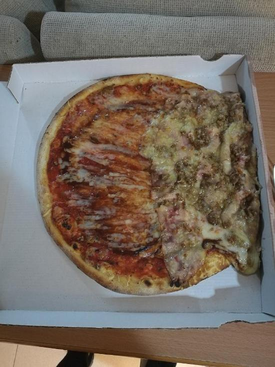

# My CV

Updated 27 May 2023

## 2023
🛠️Currently at [Xentral](https://xentral.com/) - SRE/DevOps Engineer & Chief Emoji Officer (Berlin/Remote)  

## 2022
[Xentral](https://xentral.com/) - SRE/DevOps Engineer & Chief Emoji Officer (Berlin/Remote)  
  Ansible  
  Terragrunt  
  AWS  
  NewRelic  
  ArgoCD  
  Critical Thinking 🔝😻
  
[Guidesmiths](https://www.one-beyond.com/) - DevOps Engineer (Barcelona/Remote)  

## 2021

[Guidesmiths](https://www.one-beyond.com/) - DevOps Engineer (Barcelona/Remote)  
  Kafka, SQS and Azure Service bus  
  Terraform, AWS CloudFormation and Pulumi  
  AWS, DigitalOcean, Hetzner, Azure
  ArgoCD  
  Node, AKS, EKS, DOKS  
  Multiple projects in little amount of time

[IBM](https://www.ibm.com/) - Network Architect  
  IBM Cloud & Ansible Tower  
  VAT for a Banking institution  
  SNMPv3 & red-team pentesting  
  Cloud Design Patterns  

[Nexus Geographics](https://www.nexusgeographics.com/) - Sysadmin/Devops (Girona)  

## 2020
[Nexus Geographics](https://www.nexusgeographics.com/) - Sysadmin/Devops (Girona)  
[bisual](https://bisual.net/) - Platform Engineer (Girona)  
  Some occasional side-hustles 

## 2019
[Nexus Geographics](https://www.nexusgeographics.com/) - Sysadmin/Devops (Girona)  
[Goetten Apartments](https://de.goetten.es/) - Barman (Platja d'Aro)
  
## 2018 
[Nexus Geographics](https://www.nexusgeographics.com/) - Sysadmin/Devops (Girona)  
  Physical DataCenter maintenance  
  Web services (tomcat, nginx, apache2)  
  Docker & Kubernetes  
  IoT With LoraWAN  
  ISO 27001  
  CI/CD with gitlab-ci and Jenkins  
  GIS Services  
  Hetzner cloud  
  Ansible  
  Nagios, ELK stack  
  Bash & Python scripting  
  Having lots of fun 
  
[Pizzeria Queixalada](https://www.google.com/maps/place/Pizzeries+Queixalada/@41.9764291,2.8223064,15z/data=!4m6!3m5!1s0x12bae6d9838edcd5:0xcf52f773ec3304ce!8m2!3d41.9764291!4d2.8223064!16s%2Fg%2F11bttp_hbr?entry=ttu) - Pizza Delivery (Girona)  
I once fell of the moto during a late-night rainy delivery, nevertheless the pizza was delivered like this:  
  
The [review](https://g.co/kgs/ah2388) was hilarious

[Goetten Apartments](https://de.goetten.es/) - Barman (Platja d'Aro)

## 2017
[Restaurant el Castell](https://www.tripadvisor.com/Restaurant_Review-g1078959-d5582294-Reviews-Restaurante_El_Castell-Brunyola_Province_of_Girona_Catalonia.html?m=19905) - Waiter (Brunyola)  
[Konig Perello](https://www.konig.cat/en/) - Waiter (Vilablareix)  
[Pizzeria Queixalada](https://www.google.com/maps/place/Pizzeries+Queixalada/@41.9764291,2.8223064,15z/data=!4m6!3m5!1s0x12bae6d9838edcd5:0xcf52f773ec3304ce!8m2!3d41.9764291!4d2.8223064!16s%2Fg%2F11bttp_hbr?entry=ttu) - Pizza Delivery (Girona)  
[Zanpanzar](https://www.tripadvisor.com/Restaurant_Review-g187499-d1641883-Reviews-Zanpanzar-Girona_Province_of_Girona_Catalonia.html?m=19905) - Waiter (Girona)  
[Goetten Apartments](https://de.goetten.es/) - Barman (Platja d'Aro)  

## 2016
[Shisha Bar Dreams](https://www.google.com/maps/place/Dream's+Beach+Lounge+Club/@41.8089985,3.065723,19z/data=!4m6!3m5!1s0x12bb00d07109ec23:0x7b2ebaf918a7d579!8m2!3d41.8089314!4d3.0658265!16s%2Fg%2F11bzq3js65?entry=ttu) - Barman & Waiter (Platja d'Aro)  
[Goetten Apartments](https://de.goetten.es/) - Barman (Platja d'Aro)  

## Languages

Catalan   
Spanish  
English  
French (B1)  
German (A1)  