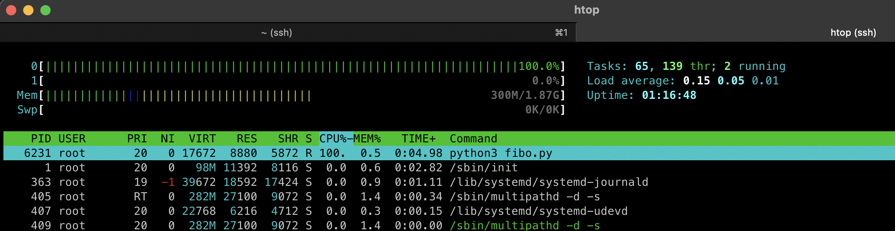

# Intro
In this post I am going to explain a bit about cgroups and it's wonders.

The [wikipedia definition](https://en.wikipedia.org/wiki/Cgroups) states that a control group (abbreviated as cgroup) is a collection of processes that are bound by the same criteria and associated with a set of parameters or limits. These groups can be hierarchical, meaning that each group inherits limits from its parent group. 

The goal of cgroups is to control the resources the processes (and subprocesses) are using.


## Cgroups v1 and v2
The initial release of the cgroups implementation was in Linux
2.6.24.  Over time, various cgroup controllers have been added to
allow the management of various types of resources.  However, the
development of these controllers was largely uncoordinated, with
the result that many inconsistencies arose between controllers
and management of the cgroup hierarchies became rather complex.
This is the reason a backwards-compatible cgroupsv2 was released officially with Linux 4.5

## Terminology
A **cgroup** is a collection of processes that are bound to a set of limits or parameters defined via the cgroup filesystem

A **subsystem** is a kernel component that modifies the behavior of
the processes in a cgroup.  Various subsystems have been
implemented, making it possible to do things such as limiting the
amount of CPU time and memory available to a cgroup, accounting
for the CPU time used by a cgroup, and freezing and resuming
execution of the processes in a cgroup.  **Subsystems are sometimes also known as resource controllers (or simply, controllers)**


The cgroups for a controller are arranged in a **hierarchy**.  This
hierarchy is defined by creating, removing, and renaming
subdirectories within the cgroup filesystem.  At each level of
the hierarchy, attributes (e.g., limits) can be defined.  The
limits, control, and accounting provided by cgroups generally
have effect throughout the subhierarchy underneath the cgroup
where the attributes are defined. Thus, for example, the limits
placed on a cgroup at a higher level in the hierarchy cannot be
exceeded by descendant cgroups.


# Cgroup Usage

To use a control group, we must create one first; we may create a cgroup via two ways.
The first one is to create a subdir in `/sys/fs/cgroup`

The second one is through the `libcgroup` utils library.

We can also get additional information of cgroups in running processes with the `/proc/$PID/cgroup` folder.

```sh
# see our current shell cgroups
cat /proc/$(echo $$)/cgroup
0::/user.slice/user-0.slice/session-150.scope
```
The output to the command above is colon-separated, from left to right:

1.  For cgroups version 1 hierarchies, this field contains a unique hierarchy ID number that can be matched to a hierarchy ID in `/proc/cgroups`. For the cgroups version 2 hierarchy, this field contains the value "0".

2. For cgroups version 1 hierarchies, this field contains
    a comma-separated list of the controllers bound to the
    hierarchy.  For the cgroups version 2 hierarchy, this
    field is empty.
    
3. This field contains the pathname of the control group
    in the hierarchy to which the process belongs.  This
    pathname is relative to the mount point of the
    hierarchy.


## Example time

We are going to play around with our cgroups, my system uses cgroupsv2. 
```sh
# To check which version of cgroups your system is using you can run `grep cgroup /proc/filesystems` 
# if you got "cgroup2" in the response, you use the cgroups v2
# if you don't have it, you use the cgroups v1
$ grep cgroup /proc/filesystems
nodev	cgroup
nodev	cgroup2
```

In this occasion we're going to test a simple fibonacci recursive function, suppose we have this python snippet:

```python
# fibonacci.py
def fibonacci(n):
    if n <= 0:
        return 0
    elif n == 1:
        return 1
    else:
        return fibonacci(n - 1) + fibonacci(n - 2)

result = fibonacci(35)
print("Fibonacci result:", result)
```

I don't know if a non-techy reader has arrived this far into the reading, but the fibonacci function is one function that calls itself infinitely or until it hits a base case (or base condition) the nice attribute of recursive functions is that they consume stack space for every call (like any other function), what matters is the times this function recurses, in this case we want 35 recursions. **And 35 recursions doesn't necessarily mean number of calls! In our case to get to the 35th number 18.454.929 calls were made!**

#### 1st step
Now let's create our first cgroup by making a directory.
`sudo mkdir /sys/fs/cgroup/fibo_group`

#### 2nd step
After that, let's spawn a separate new shell and paste it's PID of that shell into the directory:
`echo $$ | sudo tee /sys/fs/cgroup/fibo_group/cgroup.procs`

#### 3rd step
Now, let's throttle the CPU at 20%.
`echo "200000 1000000" > /sys/fs/cgroup/fibo_group/cpu.max`
In this previous command, the `cpu.max` is the maximum bandwidth limit attribute.

The first value is the allowed time quota in microseconds for which all processes collectively in a child group can run during one period. The second value specifies the length of the period.  
During a single period, when processes in a control group collectively exhaust the time specified by this quota, they are throttled for the remainder of the period and not allowed to run until the next period.  
This command sets CPU time distribution controls so that all processes collectively in the `/sys/fs/cgroup/fibo_group` cgroup can run on the CPU for only 0.2 seconds of every 1 second. That is, one fifth of each second or 20%.

If you are used to docker, this would be the value that is modified when we specify `docker run --cpu-period XXXX --cpu-quota YYYY`, in our case being the first (200000) the quota and the latter (1000000) the period.
Additionaly, the merge of those two flags result in the most-common used flag `docker run --cpus=0.2`.
You can see that in https://docs.docker.com/config/containers/resource_constraints/#configure-the-default-cfs-scheduler

### Execution time
We're all set, let's run our script (in the same shell where we issued the STEP 2 command).


Aha! It's using around 20% of usage, but why it's not 20% fixed but some fluctuating around it?
Some of you may have guessed, but when you set a CPU limit, such as 20%, it means that the control group will on average receive around 20% of the available CPU time. However, the actual CPU usage might fluctuate due to other external factors, including system load, other processes, dynamic workloads, etc.

Let's try removing the PID again with `echo $$ | sudo tee /sys/fs/cgroup/cgroup.procs` and see how much CPU does the process use:


We can both see that the process uses all the cpu bandwidth available and also that the process doesn't take as long to finish!

Refs:  
https://facebookmicrosites.github.io/cgroup2/docs/cpu-controller.html  
https://en.wikipedia.org/wiki/Cgroups  
https://man7.org/linux/man-pages/man7/cgroups.7.html  

