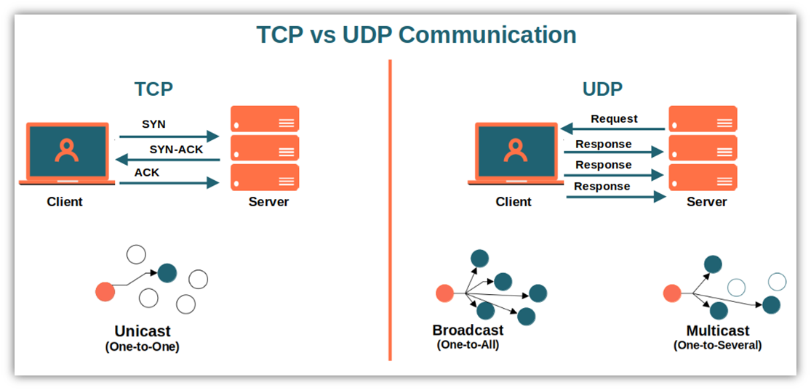
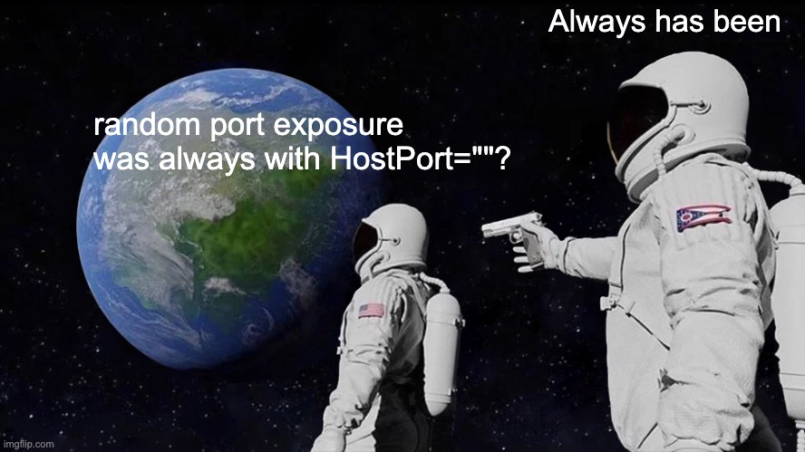
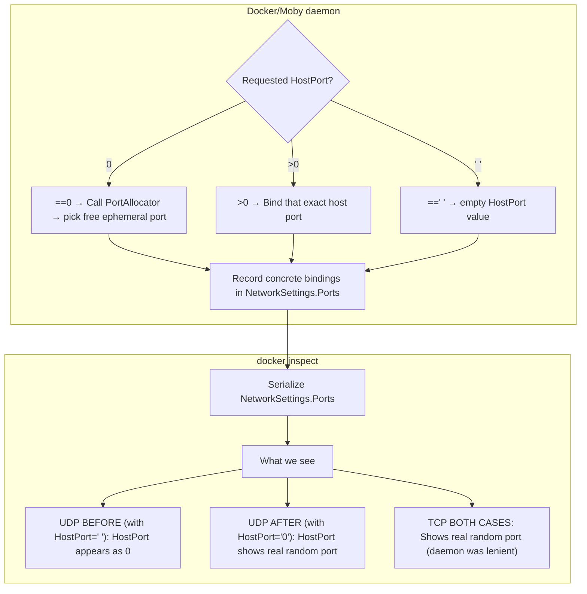

# Intro

Testcontainers (AtomicJar) was acquired by Docker around [December 2023](https://www.docker.com/blog/docker-whale-comes-atomicjar-maker-of-testcontainers), the other day I was developing something with it, and I noticed some unexpected error upon dialing an [UDP](https://en.wikipedia.org/wiki/User_Datagram_Protocol) call, the exposed port returned was `0`! :sob:.

For the non-technical people: `UDP` is a communication protocol that is not oriented to connection, fast and very efficient.
Compared to it's analogous and popular [TCP](https://en.wikipedia.org/wiki/Transmission_Control_Protocol) protocol which is widely used and guarantees the transmission of data, it retransmits lost packets and acknowledges it's reception.


Why does this happen to me? I sit in front of I guess a mix of polyvinyl alcohol and cyanobiphenyls hesitating why there is a part of my ego that gets sensitive when challenged.

It's usually the lack of coffeine, or the fact that I'm not immune to [cognitive dissonance](https://en.wikipedia.org/wiki/Cognitive_dissonance). Worry not: The only real challenge we have in our lifes is [lack of] time!
It's not the same trying to learn icelandic in 1 month than in 20 years.

## What are we going to do today?

Place ourselves under the skin of an endangered spieces: The Open Source Contributor or _Collaborator apertus_, and follow it's natural behaviour

1. Identify a bug
2. File an issue (if it does not exist already)
3. Submit our fix
4. Make the world a better place
5. Decay into biomass and let future generations enjoy the work that will outlive us

## Diving into the unknown

Excuse me, dear reader, for the extended introduction, between intellectuals (and anyone in this lonely blog is an intellectual) the context in a conversation must be rich.

Here is the problem I found myself with; while making some tests for writing some bytes using the UDP protocol, I found myself that the random port allocation did not work, specifically, that the ephemeral port returned was a literal `0`.

```go
import (
  tc "github.com/testcontainers/testcontainers-go"
  // [...]
)

func TestStatsdExpoerter(t *testing.T) {
  ctx := t.Context()

  // Start statsd-exporter
  exporter, err := tc.Run(t, statsdImage,
    tc.WithExposedPorts("9102/tcp", "9125/udp"),
    tc.WithWaitStrategy(wait.ForListeningPort("9102/tcp")),
    tc.WithAdditionalWaitStrategy(wait.ForLog("Accepting Prometheus Requests")),
  )
  require.NoError(t, err)

  // Get the mapped ports
  tcpPort, err := exporter.MappedPort(ctx, "9102/tcp")
  require.NoError(t, err) // tcpPort.Port() returns "9102"

  udpPort, err := exporter.MappedPort(ctx, "9125/udp")
  require.NoError(t, err) // udpPort.Port() RETURNS 0!
```

### Problem summary

test a docker instance and exposing two ports

- `9102/tcp`
- `9125/udp`

You can see that with the [WithExposedPorts](https://golang.testcontainers.org/features/common_functional_options/#withexposedports) function: `tc.WithExposedPorts("9102/tcp", "9125/udp"),`
random ports are allocated in the host and it maps them into the container.

This exposure of ephemeral ports is the de-facto way to expose ports in testcontainers and is [very well documented](https://golang.testcontainers.org/features/networking/#exposing-container-ports-to-the-host)

> From the host's perspective Testcontainers actually exposes this on a random free port. This is by design, to avoid port collisions that may arise with locally running software or in between parallel test runs.

### What is the expected output?

I would like two random ports in the host to be forwarding the traffic into my container.

- `HostPort 54000/tcp` -> `ContainerPort 9102/tcp`
- `HostPort 51515/udp` -> `ContainerPort 9125/udp`

Here `54000` and `51515` are random ports in my host.

### What is the actual result?

The UDP port is not randomly allocated

- `HostPort 54000/tcp` -> `ContainerPort 9102/tcp`
- `HostPort 0/udp`     -> `ContainerPort 9125/udp`

Instead port `0` is allocated in the host and of course fails with the error:

> IPv4: dial udp4 127.0.0.1:0: connect: can't assign requested address.

> IPv6: dial udp [::1]:0:      connect: can't assign requested address.

And this is an error because port `0` is NEVER used in tcp connections,
the range of ports that can be allocated is an unsigned short int `2^16-1` (from `0` to `65535`).

According to IANA:

- ports with numbers `0–1023` are called system or well-known ports
- ports with numbers `1024-49151` are called user or registered ports
- ports with numbers `49152-65535` are called dynamic, private or ephemeral ports. This ports are the ones that testcontainers use to map the connections from our host to our containers

Both system and user ports are used by transport protocols (TCP, UDP, DCCP, SCTP) to identify an application or service.

Port `0` is reserved and never used in normal TCP connections. It's mostly a placeholder meaning "no specific port" or "assign automatically".

💡 That's the clue! 💡 "assign automatically" does not seem to work. Time to dive deep into the repo and see what's failing.

## Let's begin to contribute

### 1. Check for existing errors

As an Open Source contributor (and you dear reader might become one if you aren't already) the first thing you have to do is to head over the repository you want to contribute, read the contributing guidelines and search for similar issues.

In this example, our source code is on github, it could be that it's in google codespaces, aws, bitbucket, gitlab
and god knows where else. We have to find where the bug or issue tracker is, in our case the [testcontainer-go github repo's issues tab](https://github.com/testcontainers/testcontainers-go/issues/)

Let's try to find by keywords "UDP", "port allocation", "automatic port exposure" and no similar issues seem to appear.
That means it's our turn to create one like in https://github.com/testcontainers/testcontainers-go/issues/3483.

After the issue has been created, we can create a fork of that repository, we can do so in the [github UI](https://github.com/testcontainers/testcontainers-go/fork) or with the Github CLI

### 2. Fork the repo and commit your changes

A fork brings a copy of the source code for us to tamper.

According to the contributing guidelines, the commits should follow the [conventional commits](https://www.conventionalcommits.org/en/v1.0.0/) style, and there are more considerations in the [CONTRIBUTING.md](https://github.com/testcontainers/testcontainers-go/blob/main/docs/contributing.md) file. Most open source repositories have contributing guidelines, and if they are missing, you can also create and issue [and a PR](https://github.com/vectordotdev/helm-charts/pull/509) to create them, everytime engineers find recursive calls 😄

### Smash the brains

Let's do the heavy thinking now, after some time spending understanding the logic and structure of the repository I see
that the function that controlls how ports are mapped and exposed is [mergePortBindings](https://github.com/testcontainers/testcontainers-go/blob/f95900f4c616aad8f557db8a159d336ada8eceba/lifecycle.go#L600)

We can see there's a hierarchy in the mergePortBindings function:

1. Start from exposedPortMap
2. overlay configPortMap (overrides)
3. ensure every entry in exposedPorts exists in the result.

What is missing in here is a post-merge normalization step:
Entries created with an empty HostPort `""` aren't being converted to `"0"` to tell Docker to auto-assign a port.
As we've seen before, port `0` is used by some applications including [Moby (Docker)](https://pkg.go.dev/github.com/moby/moby/libnetwork/portallocator#PortAllocator.RequestPortsInRange), stating:

> If portStart and portEnd are 0 it returns the first free port in the default ephemeral range.

We've learnt recently that the ephemeral range was from `49152-65535`

### 3. But... why only in UDP?

Both TCP and UDP ports have always had the same issue - they were getting `HostPort: ""` (empty string) instead of `HostPort: "0"`.
It's also stated in the [source code](https://github.com/docker/go-connections/blob/main/nat/nat.go#L100) that those values are not normalized.



The difference comes from how the daemon interprets the `HostPort` field:

TCP with `HostPort: ""` The daemon was lenient and implicitly treated an empty string as "please allocate a random port"
So TCP bindings appeared to work correctly, even though the client technically didn't ask for a port allocation.

UDP with `HostPort: ""` The daemon was stricter, it didn't auto-allocate a port when the host port was an empty string. As a result, UDP bindings could appear as `"HostPort": "0"` in docker inspect, meaning no real port was assigned.

So the real difference is not in protocol logic: it's how the daemon handled an unspecified port.

Empty HostPort ("") -> inconsistent behavior: TCP often worked by accident; UDP didn't.

Explicit HostPort: ("0") -> consistent behavior: both TCP and UDP trigger the same allocator path, which assigns a real random port.

### 4. Test it

Let's make a test to showcase this, bear in mind that testcontainers uses `inspect` (like when we use `docker inspect`)

```bash
# testudp.sh
echo "=== BEFORE FIX (HostPort=\"\") ==="
docker run -d --name test-udp-empty -p 8081/udp alpine sleep 30 >/dev/null
echo "[udp HostPort=\"\"] ->"
docker inspect test-udp-empty --format '{{json .NetworkSettings.Ports}}' | jq

echo "=== AFTER FIX (HostPort=\"0\") ==="
docker run -d --name test-udp-zero -p 0:8081/udp alpine sleep 30 >/dev/null
echo "[udp HostPort=\"0\"] ->"
docker inspect test-udp-zero --format '{{json .NetworkSettings.Ports}}' | jq

## Output:
=== BEFORE FIX (HostPort="") ===
[udp HostPort=""] ->
{
  "8081/udp": [
    {
      "HostIp": "0.0.0.0",
      "HostPort": "0"
    },
    {
      "HostIp": "::",
      "HostPort": "0"
    }
  ]
}
=== AFTER FIX (HostPort="0") ===
[udp HostPort="0"] ->
{
  "8081/udp": [
    {
      "HostIp": "0.0.0.0",
      "HostPort": "55070"
    },
    {
      "HostIp": "::",
      "HostPort": "55070"
    }
  ]
}
```

We can see that testcontainers-go takes the inspect in order to obtain the randomly allocated port,
here's a mermaid diagram:



The fix was perfect, I made the implicit explicit, as a very wise person and coworker told me (Bjorn).

I did some [golang tests](https://github.com/blueprismo/testcontainers-go/blob/4d3ab52d3cbd94141937b6f2502a4ad2b8cccf4d/udp_port_binding_test.go) to adopt this changes.

## Create a Pull request from your Fork to the upstream repository

When you are done with your changes, created tests that ensure they work (and tested they failed) it's time to merge our work.
We commit our changes, and create a Pull Request (PR) with a rich description and respecting the PR template of the repository:

https://github.com/testcontainers/testcontainers-go/pull/3485

In my case, as now I have the privilege to work @ Docker Inc, I could ping through slack a mantainer of the testcontainers-go project in slack ([Manu de la Peña](https://github.com/mdelapenya)), after syncing with him and a thorougly review, the Pull Request was merged into the main branch and the fix is available in [testcontainers-go@v0.40.0](https://github.com/testcontainers/testcontainers-go/commit/1ed273507d6766bd98cc1780b6bbc02352fcfce0). Human capital at it's best 😀!!

## Conclusions

- Converting `HostPort: ""` to `HostPort: "0"` ensures:
  1. Consistent behavior: Both TCP and UDP get the same explicit ephemeral port request
  2. Proper Docker API usage: Using the documented "0" for automatic port allocation
  3. Bypass of edge cases: Avoiding any inconsistencies in Docker's empty string handling

- Human connections are very important, both for the psychological and technical aspects of it!
- [Contributing to OSS](https://en.wikipedia.org/wiki/Open-source_software) is a really nice way to make the world a better place from your home.

Thanks for reading until here, wish you a wonderful time ahead 🌻
