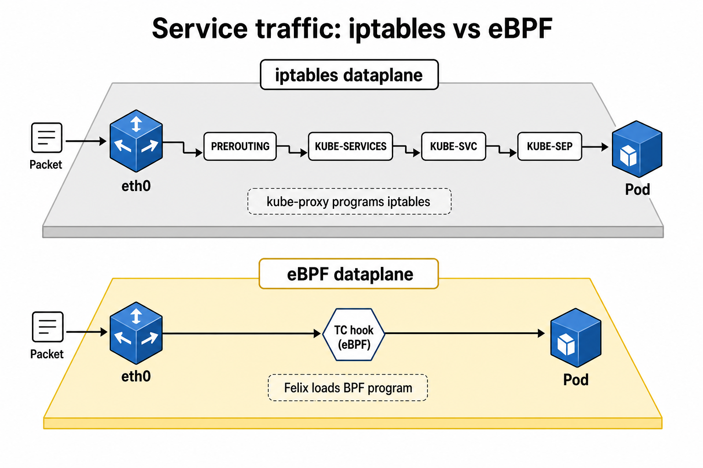

# Intro

In the [previous article](/posts/2026/calico/) we deployed Calico on top of k3s, replaced Flannel, and played with `NetworkPolicy` and `GlobalNetworkPolicy` to control traffic inside our cluster. We closed that article with a promise: looking under the hood at one of Calico's most interesting features, the **eBPF dataplane**.

Today we deliver on that promise. We'll enable eBPF mode, disable `kube-proxy` entirely, and verify that Services, NetworkPolicy, and GlobalNetworkPolicy still behave exactly as they did before — except now the kernel is doing a lot less work to get there.

As always: experiment, tweak, break things, and ask "why" a lot. That's the fun part.

## Prerequisites

### The same cluster as before

If you followed [part one](/posts/2026/calico/), you already have most of what's needed. We'll rebuild the cluster from scratch in this article, mostly so we can pass one extra flag at creation time (`--disable-kube-proxy`), but everything else — k3d, Helm, the Tigera Operator, the v3 CRDs — is unchanged.

### A recent Linux kernel

The eBPF dataplane needs a Linux kernel that supports the required BPF features: **v5.10+** (or a Red Hat kernel v4.18.0-305+, which has the necessary backports). Since we're running k3d, the kernel that matters is the one on the Docker host, not inside the container. Check it with:

```sh
uname -rv
```

If you're on Docker Desktop (macOS/Windows), the Linux kernel running inside the Docker VM is what counts, and recent versions are comfortably above v5.10.

```sh
# try to run
docker run --rm alpine uname -rv

# or
docker info | grep Kernel
```

### bpftool (optional, but fun)

We'll mostly use the tool that ships inside the `calico-node` image (`calico-node -bpf ...`), so nothing extra to install. If you want to go spelunking with raw `bpftool`, it's also available inside the `calico-node` container.

## Concepts

### A quick recap: how Services work with kube-proxy

Kubernetes Services are a virtual abstraction: a stable IP (the `ClusterIP`) that load-balances to a changing set of backend Pods. Something has to translate "traffic to 10.96.0.10:80" into "traffic to one of these three Pod IPs", and that something is traditionally `kube-proxy`.

[kube-proxy](https://kubernetes.io/docs/reference/command-line-tools-reference/kube-proxy/) watches Services and Endpoints, then programs the host's `iptables` rules so the kernel's regular network stack does the NAT for it. A packet destined for a ClusterIP walks through several `iptables` chains — `PREROUTING`, `KUBE-SERVICES`, `KUBE-SVC-*`, `KUBE-SEP-*` — before it's finally DNAT'd to a Pod IP.

This works, but it has costs:

- Rule evaluation is roughly linear in the number of Services (large clusters can have thousands of `iptables` rules).
- Every packet is matched against chains sequentially.
- Updating rules for a busy cluster with high Service/Endpoint churn is expensive.

### The eBPF dataplane

**eBPF** (we introduced it briefly in part one) lets Calico attach small, verified programs directly to network interfaces using kernel hooks, instead of relying on `iptables`/`kube-proxy` to do NAT and policy enforcement.

When eBPF mode is enabled, Felix (Calico's per-node agent) compiles and loads BPF programs that:

- Implement Service load balancing (replacing `kube-proxy` completely).
- Enforce NetworkPolicy and GlobalNetworkPolicy directly in the kernel.
- Track connections using their own BPF conntrack table (instead of the kernel's `nf_conntrack`).

The result is a much shorter, flatter path for every packet.


In the iptables dataplane, a packet destined for a Service walks through several sequential chains before it reaches the Pod. In the eBPF dataplane, a single BPF program attached via a TC hook ([Traffic Control](https://docs.ebpf.io/ebpf-library/libbpf/userspace/bpf_tc_hook_create/)) does the same job in one hop.

### TC hooks vs XDP

Calico's eBPF programs attach at two different points:

- **TC (Traffic Control) hooks**: attached to the ingress/egress of network interfaces (host interfaces and the host side of Pod veth pairs). This is where most of Calico's eBPF logic lives — NAT, policy, conntrack.
- **XDP (eXpress Data Path)**: attached even earlier, right as the packet arrives at the NIC driver, before the kernel builds a full [skb](https://docs.kernel.org/networking/skbuff.html). Calico uses XDP for `doNotTrack` policies on host endpoints, where the goal is to drop unwanted traffic as cheaply as possible.

If you want an analogy, TC hooks are the workhorse and XDP is the scalpel for a very specific, performance-critical case.
How XDP and TC hooks appear in the phisical representation of the network layers:

```sh
# This is the RECEIVE PATH (adapted from: https://kernel-internals.org/net/network-stack-overview/#the-receive-path-in-one-picture)
NIC DMA → ring buffer
    ↓ interrupt (or polling)
NAPI poll (NET_RX_SOFTIRQ)
    ├── XDP programs (if attached)  ← early drop/redirect (before skb allocation)
    ↓ skb = napi_build_skb()
    ├── TC ingress (clsact qdisc)   ← Calico eBPF dataplane hooks here
__netif_receive_skb()
    ↓ protocol demux (Ethernet type)
    ├── Packet sockets (tcpdump)
    ├── Netfilter (PREROUTING hook)
    ↓
ip_rcv() → ip_rcv_finish()
    ↓ routing decision
    ├── Forward: ip_forward() → Netfilter (FORWARD) → ip_output()
    └── Local: ip_local_deliver()
              ↓ Netfilter (INPUT hook)
              ↓ transport demux (proto = TCP/UDP/ICMP)
              tcp_v4_rcv() / udp_rcv()
              ↓ socket lookup (hash table)
              sk->sk_receive_queue.push(skb)
              sk->sk_data_ready(sk) → wake up reader

## If you want a simplification:
NIC
 ├── XDP  ← before skb (raw packet)
 ├── skb allocation
 ├── TC ingress  ← Calico eBPF policy, NAT, conntrack, load balancing
 └── Linux networking stack
```

### Connect-Time Load Balancing (CTLB)

One neat optimization is Connect-Time Load Balancing (CTLB). For TCP connections originating from a Pod on the same node, Calico intercepts the application's connect() system call, selects a backend Pod, and rewrites the socket's destination before the first packet is transmitted.
As a result, the initial SYN packet is sent directly to the chosen backend, avoiding the usual per-packet Service NAT on the datapath.

This means:

- No per-packet NAT overhead for that connection.
- The BPF conntrack table won't show a translated entry for these connections; the "NAT" already happened before the packet was built. You'll just see a direct Pod-to-Pod connection.

By default, CTLB is enabled for TCP; it's one of the reasons eBPF-mode clusters can push equivalent traffic with lower CPU usage.

### DSR vs Tunnel mode

For traffic coming from *outside* the cluster (NodePorts, LoadBalancers), Calico has two strategies once it picks a backend Pod on a different node:

- **Tunnel mode** (default): traffic is forwarded to the node hosting the Pod over VXLAN, processed there, and the response goes back the same way.
- **DSR (Direct Server Return)**: the response goes straight from the backend node to the client, skipping the return hop through the node that first received the traffic. Lower latency, less CPU, but it requires the underlying network to allow a node to reply "on behalf of" another node's IP (e.g. disabling source/dest checks on AWS).

We won't need DSR for our single-node k3d demo, but it's worth knowing it exists for real multi-node clusters chasing every last bit of latency.

### Why replace kube-proxy at all?

Putting it all together, the eBPF dataplane can give you:

- **Lower latency**: fewer hops, no sequential chain matching.
- **Better scalability**: BPF map lookups are effectively O(1), while `iptables` rule evaluation grows with cluster size O(n).
- **Less CPU overhead**: no dual bookkeeping between `kube-proxy` and Felix fighting over the same iptables rules.
- **Unified enforcement**: Services and policy are handled by the same dataplane instead of two separate subsystems (`kube-proxy` + Calico's `iptables`/`ipsets` policy rules).

The trade-off is a shorter list of supported distributions/kernels and some feature gaps (no IPIP, no `etcd` datastore, no SCTP), which is why it's opt-in rather than the default.

---

## Hands on

### Rebuilding the cluster with kube-proxy disabled

k3s bundles its own `kube-proxy`, started directly by the supervisor process rather than as a Kubernetes `DaemonSet` object you could `kubectl patch`. The cleanest way to get rid of it is the `--disable-kube-proxy` server flag, so let's bake that into cluster creation, same as we did with Flannel in part one:

```sh
k3d cluster create calico-ebpf \
  --image rancher/k3s:v1.35.5-k3s1 \
  --k3s-arg "--flannel-backend=none@server:0" \
  --k3s-arg "--disable-network-policy@server:0" \
  --k3s-arg "--disable-kube-proxy@server:0" \
  --k3s-arg "--kube-apiserver-arg=feature-gates=MutatingAdmissionPolicy=true@server:0" \
  --k3s-arg "--kube-apiserver-arg=runtime-config=admissionregistration.k8s.io/v1beta1=true@server:0"
```

Just like before, the node will sit `NotReady` and system Pods `Pending` until we install a CNI. This time, there's also no `kube-proxy` process running at all:

```sh
❯ kubectl get pods -n kube-system
NAME                                      READY   STATUS    RESTARTS   AGE
coredns-8db54c48d-4jvtj                   0/1     Pending   0          40s
metrics-server-786d997795-nw6kd           0/1     Pending   0          40s
local-path-provisioner-5d9d9885bc-qgh44   0/1     Pending   0          40s
# no kube-proxy anywhere — it never started
```

### Telling Calico how to reach the API server directly

Here's the catch: `kube-proxy` is normally the thing that makes the `kubernetes.default.svc` ClusterIP work. Without it, nothing can NAT traffic to that virtual IP, including Calico's own components, which need to talk to the API server. Since Calico's whole point in eBPF mode is to *replace* `kube-proxy`, we need to give it a real, stable address to reach the API server directly, before it can bootstrap that replacement.

Grab the node's address:

```sh
❯ kubectl get nodes -o wide
NAME                       STATUS     ROLES           AGE   VERSION        INTERNAL-IP
k3d-calico-ebpf-server-0   NotReady   control-plane   45s   v1.35.5+k3s1   172.20.0.2
```

Then create the `tigera-operator` namespace and a `ConfigMap` telling the operator (and, transitively, Felix) exactly how to reach the API server:

```sh
kubectl create namespace tigera-operator

cat <<EOF | kubectl apply -f -
apiVersion: v1
kind: ConfigMap
metadata:
  name: kubernetes-services-endpoint
  namespace: tigera-operator
data:
  KUBERNETES_SERVICE_HOST: "172.20.0.2"
  KUBERNETES_SERVICE_PORT: "6443"
EOF
```

In a real cluster, this would point at your API server's load balancer (or the control-plane node's stable address for a single-master setup). For our k3d demo, the node's own IP on the Docker network works because the API server listens there directly.

### Installing Calico in eBPF mode

Same Helm chart, same CRDs, same version as before (`v3.32.1`) — the only change is one extra field in `values.yaml`: `linuxDataplane: BPF`.

```sh
helm repo add projectcalico https://docs.tigera.io/calico/charts

cat > values.yaml <<EOF
installation:
  cni:
    type: Calico
  calicoNetwork:
    linuxDataplane: BPF
    bgp: Disabled
    ipPools:
      - cidr: 10.42.0.0/16 # k3s default Pod CIDR.
        encapsulation: VXLAN
        natOutgoing: Enabled
        nodeSelector: all()
EOF

helm template calico-crds projectcalico/projectcalico.org.v3 --version v3.32.1 | kubectl apply --server-side -f -

helm install calico projectcalico/tigera-operator \
  --version v3.32.1 \
  -f values.yaml \
  --namespace tigera-operator

watch kubectl get pods -n calico-system
```

Recall from part one that IPIP is one of the encapsulation modes Calico supports. In eBPF mode it's unsupported entirely, so VXLAN is the only sensible overlay choice here — which is convenient, since it's also what we were already using.

Wait for everything to settle:

```sh
❯ kubectl get tigerastatus
NAME        AVAILABLE   PROGRESSING   DEGRADED   SINCE   MESSAGE
apiserver   True        False         False      3m      All objects available
calico      True        False         False      3m      All objects available
goldmane    True        False         False      3m      All objects available
ippools     True        False         False      3m      All objects available
tiers       True        False         False      3m      All objects available
whisker     True        False         False      3m      All objects available
```

### Verifying eBPF mode is active

The `FelixConfiguration` resource is the source of truth:

```sh
❯ kubectl get felixconfiguration default -o jsonpath='{.spec.bpfEnabled}'
true
```

You can also confirm it from the `calico-node` logs, which log an explicit `INFO` line on startup:

```sh
❯ kubectl logs -n calico-system -l k8s-app=calico-node -c calico-node | grep -i "bpf"
2026-07-14 10:45:27.700 [INFO][88] felix/summary.go 100: Summarising 68 dataplane reconciliation loops over 1m20.1s: avg=27ms longest=266ms (resync-bpf-ipsets,resync-bpf-routes,resync-calico-arp-v4,resync-calico-v4,resync-failsafes,resync-filter-v4,resync-ipsets-v4,resync-kube-proxy-v4,resync-mangle-v4,resync-nat-v4,resync-nft-sets-v4,resync-raw-v4,resync-routes-v4,resync-routes-v4,resync-rules-v4,update-bpf-routes,update-calico-arp-v4,update-calico-v4,update-data-iface,update-data-iface,update-data-iface,update-routes,update-vxlan-vteps)
2026-07-14 10:46:47.700 [INFO][88] felix/summary.go 100: Summarising 3 dataplane reconciliation loops over 1m20s: avg=16ms longest=17ms (resync-bpf-ipsets,resync-calico-arp-v4,resync-calico-v4,resync-ipsets-v4,resync-nft-sets-v4)
```

If the kernel didn't support it, you'd see a loud `ERROR` line falling back to the standard dataplane instead, worth keeping in mind if you're trying this on an older host.

### Testing Services without kube-proxy

Time for the real test: does anything actually work with zero `kube-proxy` on the box? Let's redo the server/client demo from part one, this time through a proper `Service` ClusterIP instead of a Pod IP:

```sh
kubectl create ns calico-demo

kubectl run server -n calico-demo \
  --image=nginx \
  --labels app=server

kubectl expose pod server -n calico-demo --port 80

kubectl run client -n calico-demo \
  --image=curlimages/curl \
  --labels role=client \
  -- sleep 3600

kubectl wait pod/server -n calico-demo --for=condition=Ready --timeout=90s
kubectl wait pod/client -n calico-demo --for=condition=Ready --timeout=90s

kubectl exec -n calico-demo client -- curl -I http://server
# HTTP/1.1 200 OK
```

It just works — and there's no `kube-proxy` in sight to take credit for it. Calico's BPF programs are doing the ClusterIP → Pod IP translation entirely in the kernel.

We can double check there isn't a stray `KUBE-SVC` rule floating around either (since it never had a chance to write any):

```sh
❯ docker exec k3d-calico-ebpf-server-0 iptables-save | grep -c KUBE-SVC
0
```

Zero!

Calico's `iptables` rules (for policy bookkeeping) may still exist depending on version, but the `kube-proxy` Service chains are simply absent, because `kube-proxy` never ran.

### Peeking inside the eBPF dataplane

This is the fun part. Let's find a `calico-node` Pod and use the built-in `calico-node -bpf` tool to look at the actual BPF maps backing our Service:

```sh
❯ kubectl get pods -n calico-system -l k8s-app=calico-node -o name
pod/calico-node-9k2pl
```

#### The NAT table

This is Calico's replacement for `kube-proxy`'s Service chains — a map of `ClusterIP:port` to backend Pod IPs:

```sh
❯ kubectl exec -n calico-system calico-node-9k2pl -- calico-node -bpf nat dump
10.43.108.201 port 80 proto 6 id 0 count 1 local 0
  0:0	 10.42.0.16:80
10.96.0.10 port 53 proto 17 id 1 count 1 local 0
  1:0	 10.42.0.5:53
10.96.0.10 port 53 proto 6 id 2 count 1 local 0
  2:0	 10.42.0.5:53
10.96.0.1 port 443 proto 6 id 3 count 1 local 0
  3:0	 172.20.0.2:6443
255.255.255.255 port 30797 proto 6 id 12 count 1 local 1
	12:0	 10.42.0.12:8443
[...]
```

There it is: our `server` Service's ClusterIP (`10.43.108.201:80`) resolves to a single backend, the nginx Pod on `10.42.0.16:80`. Notice `10.96.0.1:443` as well, that's `kubernetes.default.svc` itself, now resolved by Calico directly to the real API server address we gave it in the `ConfigMap` [earlier](#telling-calico-how-to-reach-the-api-server-directly). Full circle 🧘

#### The conntrack table

Calico keeps its own connection tracking table in a BPF map instead of relying on `nf_conntrack`:

```sh
❯ kubectl exec -n calico-system calico-node-9k2pl -- calico-node -bpf conntrack dump
TCP 10.42.0.17:52344 -> 10.43.108.201:80 -> 10.42.0.16:80  Active ago 3.912s ESTABLISHED
```

Notice the three addresses on that line: client, Service IP, and real backend — proof the NAT decision is being tracked and reused for subsequent packets in the same connection, without touching `iptables` at all.

If you curl again from a shell running *inside* the client Pod, you might notice this entry doesn't show the Service IP at all for some connections, that's Connect-Time Load Balancing kicking in and resolving the NAT at `connect()` time, before any packet was even built.

#### Counters, in case you're paranoid about drops

```sh
❯ kubectl exec -n calico-system calico-node-9k2pl -- calico-node -bpf counters dump --iface=eth0
+----------+---------------------+---------+--------+-----+
| CATEGORY |        TYPE         | INGRESS | EGRESS | XDP |
+----------+---------------------+---------+--------+-----+
| Accepted | by policy           |       0 |      6 | N/A |
| Dropped  | by policy           |       0 |      0 | N/A |
| Total    | packets              |      12 |      6 | N/A |
+----------+---------------------+---------+--------+-----+
```

A rising `Dropped by policy` counter is the eBPF-mode equivalent of "check your NetworkPolicy", exactly the same debugging instinct as before, just a different tool to look with.

### NetworkPolicy and GlobalNetworkPolicy still apply

The best part of this whole exercise: from the user's point of view, *nothing changes*. Let's re-run the default-deny scenario from part one to prove it:

```sh
cat <<'EOF' | kubectl apply -f -
apiVersion: networking.k8s.io/v1
kind: NetworkPolicy
metadata:
  name: default-deny-ingress
  namespace: calico-demo
spec:
  podSelector: {}
  policyTypes:
    - Ingress
EOF

kubectl exec -n calico-demo client -- curl -m 5 -I http://server
# curl: (28) Connection timed out after 5004 milliseconds
```

Still blocked, exactly like before. Under the hood, this rule isn't an `iptables` chain anymore, rather it's a BPF program attached to the TC hook of the Pod's `veth`, evaluated inline as part of the same pass that does Service NAT. We can even see it if we dump the policy attached to that Pod's interface:

```sh
❯ kubectl get pod server -n calico-demo -o jsonpath='{.status.podIP}'
10.42.0.16

❯ POD_IP=$(kubectl get pod server -n calico-demo -o jsonpath='{.status.podIP}')

❯ kubectl exec -n calico-system calico-node-9k2pl -c calico-node -- \
  ip route get "$POD_IP"

10.42.54.13 dev calif54d53ad956 src 172.19.0.3 uid 0
    cache

## then
❯ kubectl exec -n calico-system calico-node-9k2pl -c calico-node -- calico-node -bpf policy dump calif54d53ad956 ingress
IfaceName: calif54d53ad956
Hook: tc egress
  Tier: default
    Policy: KubernetesNetworkPolicy calico-demo/default-deny-ingress 0
    End Policy: KubernetesNetworkPolicy calico-demo/default-deny-ingress 0
  End Tier: default  (action: deny)
      Rule: kns.calico-demo  Action: allow
      Hit count: 1
```

Same story for `GlobalNetworkPolicy`. Feel free to replay the `allow-dns` and cluster-wide `default-deny` GlobalNetworkPolicy from part one here; the outcome (DNS allowed, everything else blocked) is identical, only the enforcement point moved from `iptables`/`ipsets` into the kernel's BPF verifier-checked bytecode.

## Conclusions

Today we've learned:

- How the eBPF dataplane replaces both `kube-proxy` and Calico's own `iptables`-based policy engine with BPF programs attached via TC hooks.
- How to build a cluster with `kube-proxy` fully disabled, and how to point Calico directly at the API server so it can bootstrap without it.
- How to enable eBPF mode on the Tigera Operator's `Installation` resource with a single field: `linuxDataplane: BPF`.
- How to peek inside Calico's BPF maps with `calico-node -bpf` — NAT tables, conntrack, and per-interface policy — to see Service load balancing and policy enforcement happening in the kernel in real time.
- That Connect-Time Load Balancing resolves Service NAT at `connect()` time for TCP, skipping per-packet translation entirely.
- That from a user's perspective, `NetworkPolicy` and `GlobalNetworkPolicy` behave identically whether the dataplane is `iptables` or `BPF` — the difference is all in performance and scalability, not behavior.

If you're running Calico at any real scale, or just enjoy shaving latency and CPU off every hop your packets take, the eBPF dataplane is very much worth the (relatively small) migration effort.

Have a wonderful day!
