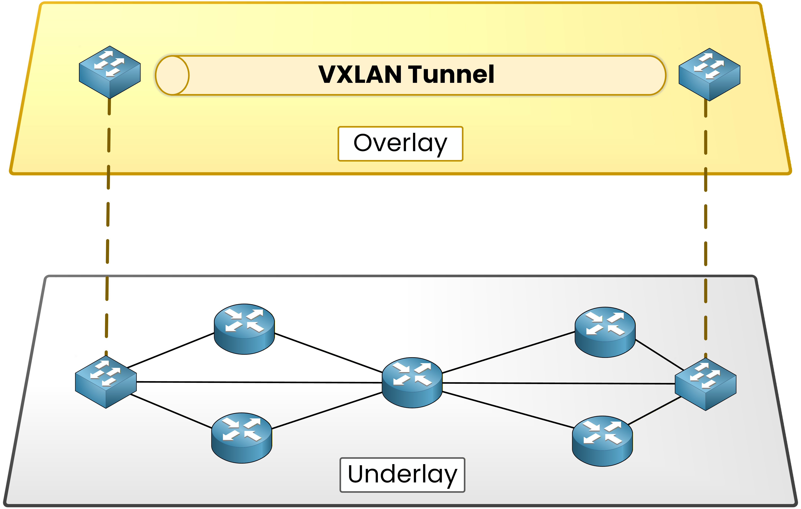
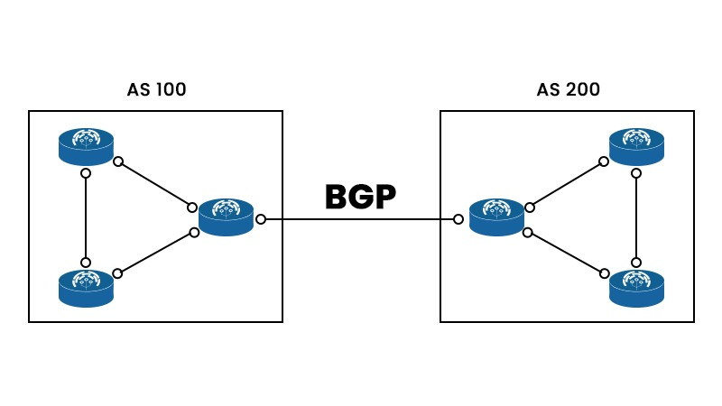

# Intro

Feeling curious to dive deeper on how calico works, why is it used, and want to find a way to test it locally. IMHO that's the best way of learning something, to experiment, tweak, answer questions and think outside the box.

For that reason today this article will be related on how to deploy calico and explore it's core functionality.
In some years this will deem outdated, but for the readers that are both curious and want to experiment, the closer in time you are reading these words, the smaller the drift between what I've tested and what the future will bring (lots of breaking changes, deprecations, and maybe even some friends along the way!)

## Prerequisites

### Kubernetes (k3s) >=1.34

We will need a k8s cluster, I will use [k3s](https://docs.k3s.io/quick-start) as it's a lightweight k8s distribution and it's easy, fast and cheap to set up.

Calico uses [MutatingAdmissionPolicies](https://kubernetes.io/docs/reference/access-authn-authz/mutating-admission-policy/) for defaulting, which require the beta `admissionregistration.k8s.io/v1beta1` API. That API is available in Kubernetes 1.34 and later.

If you want to use a cluster in EKS, GKE, AKS or Mirantis Kubernetes Engine (MKE), bear in mind that some additional steps might be needed

### Helm

We will install calico via it's helm chart, so for that reason we will need [helm](https://helm.sh/docs/overview/)

## What is Calico?

Calico is a cat breed, and a very cool project created and open sourced by Tigera! For an analogy it is a "Network Police" for kubernetes. It enables CNI networking and it can also act as a NPE (Network Policy Engine).

The Kubernetes network model defines a "flat" network in which:

- Every pod get its own IP address.
- Pods on any node can communicate with all pods on all other nodes without NAT.

Within this model there's quite a lot of flexibility for supporting different networking approaches and environments. The details of exactly how the network is implemented depend on the combination of CNI, network, and cloud provider plugins being used.

## Concepts

Here are some important concepts the reader should know to follow the article properly, if you're familiar with linux, networking and k8s, you can skip to the  section.

### Container Network Interface (CNI)

The **Container Network Interface** is a specification and plugin system that Kubernetes uses to connect Pods to the network.

When Kubernetes creates a pod, it delegates networking to the configured CNI plugin, which is responsible for:

- Assigning an IP address to the Pod
- Connecting the Pod to the cluster network
- Configuring routing so Pods can communicate
- Optionally enforcing network policies and other networking features

Examples of CNI implementations include Flannel, Calico, Cilium, Antrea, etc.

### Network Policy Engine (NPE)

A **Network Policy Engine** enforces Kubernetes [NetworkPolicy](https://kubernetes.io/docs/reference/generated/kubernetes-api/v1.36/#networkpolicy-v1-networking-k8s-io) resources.

By default, pods can communicate freely with one another. Network policies allow administrators to restrict traffic by defining rules such as:

- Which Pods may communicate
- Which namespaces may communicate
- Which ports and protocols are allowed
- Whether traffic is allowed in the ingress, egress, or both directions

Not every CNI implements network policy. For example:

- Flannel provides networking but not policy enforcement ❌
- Calico and Cilium provide both networking and policy enforcement ✅

### VXLAN (Virtual eXtensible LAN)

**VXLAN** is a network encapsulation protocol used to build virtual Layer 2 networks on top of existing Layer 3 IP networks.

Instead of requiring the physical network to know about every pod, VXLAN encapsulates Pod traffic inside UDP packets, allowing pods on different nodes to communicate as if they were on the same local network.

Benefits include:

- No changes required to the underlying physical network
- Works well in cloud environments
- Simple to deploy across multiple nodes

The trade-off is a small amount of encapsulation overhead.

### IPIP

**IPIP** is another encapsulation mode where one IP packet is wrapped inside another IP packet.

Like VXLAN, `IPIP` is used to create an overlay network so Pods on different nodes can communicate without requiring the underlying physical network to understand Pod IP addresses.

The difference is how the packet is wrapped:

- **IPIP** wraps a Pod packet inside another IP packet.
- **VXLAN** wraps a Pod packet inside a UDP packet.

In Calico, IPIP is commonly associated with traditional Linux networking and BGP-based Calico deployments. VXLAN is often easier to use in environments where the underlying network does not support or participate in Pod routing.

For simple local demos, VXLAN is usually the easier choice.

### BGP (Border Gateway Protocol)

**BGP** is the Internet's standard routing protocol, but it is also commonly used inside data centers and Kubernetes clusters.

Instead of encapsulating traffic, Calico can use BGP to advertise Pod network routes directly between nodes (or to physical routers). This allows traffic to be routed natively without an overlay network.

Advantages include:

- No encapsulation overhead
- Efficient routing
- Better performance in many on-premises environments

BGP typically requires cooperation from the surrounding network infrastructure, making it more common in private data centers than in managed cloud environments.

### Overlay vs Native Routing

Container networking generally follows one of two models:

- **Overlay networking** encapsulates traffic (for example, using VXLAN) so the physical network does not need to know about Pod IP addresses. This is simple to deploy and common in cloud environments.
- **Native routing** advertises Pod routes directly (for example, using BGP). This avoids encapsulation overhead but requires the surrounding network to understand those routes.

Calico supports both approaches, allowing operators to choose the one that best fits their environment.

VXLAN hides the pod network from the physical network by tunneling packets between nodes, while BGP teaches the physical network where the pod networks are so packets can be routed directly without tunneling.

#### A visual example of VXLAN


In the above image, the "cubes" are the virtual ethernet encapsulating the underlay packages


#### A visual example of BGP


In the above image, each node advertises it's addresses ('node AS100' and 'node AS200') that way the network is "aware" on how packets need to be trasmitted.

In cloud providers (AWS, Azure, GCP...) you usually can't tell the cloud routers about your Pod networks, and that's why VXLAN is preferred. But in scenarios where you know/control the routers, like in a data-centers, BGP is preferred as you don't have encapsulation overhead.

### eBPF (Extended Berkeley Packet Filter)

**eBPF** is a Linux kernel technology that allows small, sandboxed programs to run safely inside the kernel.

Modern networking projects such as Calico and Cilium use eBPF to process packets directly in the kernel, avoiding much of the traditional networking stack.

Using eBPF can provide:

- Lower latency
- Higher throughput
- More efficient network policy enforcement
- Reduced reliance on tools such as iptables

Because packet processing happens closer to the kernel, eBPF-based networking often scales better than traditional approaches.

### Tigera Operator

The **Tigera Operator** is the Kubernetes Operator responsible for installing, configuring, and managing Calico.

Instead of manually applying dozens of Kubernetes manifests, users install the operator and define their desired configuration through Kubernetes custom resources (CRs). The operator continuously reconciles the cluster to ensure the deployed Calico components match the declared state.

This follows the Kubernetes Operator pattern, making Calico installation, upgrades, and configuration changes more reliable and easier to automate.

---

## Hands on

K3s is a lightweight distribution for k8s, and it uses [flannel](https://github.com/flannel-io/flannel) which is intentionally simple.

As flannel doesn't suffice for our goals (it doesn't provide advanced network policy enforcement, doesn't provide BGP, eBPF dataplane, etc. ❌), we will install it with flannel disabled and it's lightweight network policy controller (kube-router)
because Calico will provide that functionality for us

There is initially no Pod networking until Calico is installed, but the intent is to replace Flannel with another CNI.

```sh
k3d cluster create calico \
  --image rancher/k3s:v1.35.5-k3s1 \
  --k3s-arg "--flannel-backend=none@server:0" \
  --k3s-arg "--disable-network-policy@server:0" \
  --k3s-arg "--kube-apiserver-arg=feature-gates=MutatingAdmissionPolicy=true@server:0" \
  --k3s-arg "--kube-apiserver-arg=runtime-config=admissionregistration.k8s.io/v1beta1=true@server:0"

# wait for the installation to succeed
❯ k get po --all-namespaces
NAMESPACE     NAME                                      READY   STATUS    RESTARTS   AGE
kube-system   coredns-8db54c48d-4jvtj                   0/1     Pending   0          3m7s
kube-system   helm-install-traefik-ccjbh                0/1     Pending   0          3m5s
kube-system   helm-install-traefik-crd-nvgfw            0/1     Pending   0          3m5s
kube-system   local-path-provisioner-5d9d9885bc-qgh44   0/1     Pending   0          3m7s
kube-system   metrics-server-786d997795-nw6kd           0/1     Pending   0          3m7s
❯ k get nodes
NAME                  STATUS     ROLES           AGE     VERSION
k3d-calico-server-0   NotReady   control-plane   3m16s   v1.35.5+k3s1
```

At this point, the cluster is created successfully, but the node is `NotReady` and system Pods are `Pending`.

This is expected: we disabled Flannel, so k3s has no CNI plugin installed yet. Kubernetes can start the control plane, but it cannot schedule normal Pods until a CNI initializes Pod networking.

Installing Calico will provide the missing CNI functionality and move the node to `Ready`.

### Installing calico

After setting up our CNI-less cluster, we need to install the tigera-operator:

We will add this helm repo, and then add some values to set our VXLAN

```sh
helm repo add projectcalico https://docs.tigera.io/calico/charts

# you can see the default values in
# https://raw.githubusercontent.com/projectcalico/calico/31a5aff4b21ae333aa728ae330bdc9f25088e1e0/charts/tigera-operator/values.yaml
cat > values.yaml <<EOF
installation:
  cni:
    type: Calico
  calicoNetwork:
    bgp: Disabled
    ipPools:
      - cidr: 10.42.0.0/16 # k3s default Pod CIDR.
        encapsulation: VXLAN # Select our mode (IPIP, VXLAN, BGP...)
        natOutgoing: Enabled
        nodeSelector: all()
EOF

# Create the namespace
kubectl create namespace tigera-operator
```

#### Now... custom resources

The calico project has brought [native v3 CRDs](https://docs.tigera.io/calico/latest/operations/native-v3-crds) which eliminate the need for the aggregation API server and allows kubectl to manage `projectcalico.org/v3` resources directly. The v3 CRDs are not in GA, worth exploring how it looks.

You can install the crds with:

```sh
helm template calico-crds projectcalico/projectcalico.org.v3 --version v3.32.1 | kubectl apply --server-side -f -
```

Once the CRDs (v3) are installed, you can install our calico deployment with

```sh
helm install calico projectcalico/tigera-operator \
  --version v3.32.1 \
  -f values.yaml \
  --namespace tigera-operator

## After helm install, verify all the calico components are healthy, and that other pods spawn succesfully
watch kubectl get pods -n calico-system
```

Thanks to the v3 crds, we can also have a quick glance of how the calico components statuses are:

```sh
❯ kubectl get tigerastatus
NAME        AVAILABLE   PROGRESSING   DEGRADED   SINCE   MESSAGE
apiserver   True        False         False      18m     All objects available
calico      True        False         False      18m     All objects available
goldmane    True        False         False      18m     All objects available
ippools     True        False         False      19m     All objects available
tiers       True        False         False      19m     All objects available
whisker     True        False         False      18m     All objects available

## see pod IPs
❯ kubectl get pods -A -o wide
kubectl get ippools.projectcalico.org
NAMESPACE         NAME                                       READY   STATUS      RESTARTS   AGE   IP             NODE                  NOMINATED NODE   READINESS GATES
calico-system     calico-kube-controllers-7968695b58-6gptp   1/1     Running     0          20m   10.42.75.193   k3d-calico-server-0   <none>           <none>
calico-system     calico-node-rkgsw                          1/1     Running     0          20m   172.19.0.3     k3d-calico-server-0   <none>           <none>
calico-system     calico-typha-74d846c868-qm8hq              1/1     Running     0          20m   172.19.0.3     k3d-calico-server-0   <none>           <none>
calico-system     calico-webhooks-77b8d7c4b9-r766r           1/1     Running     0          20m   10.42.75.194   k3d-calico-server-0   <none>           <none>
calico-system     calico-webhooks-77b8d7c4b9-x4cgm           1/1     Running     0          20m   10.42.75.199   k3d-calico-server-0   <none>           <none>
calico-system     goldmane-5b8dc7b7bf-qbfht                  1/1     Running     0          20m   10.42.75.195   k3d-calico-server-0   <none>           <none>
calico-system     whisker-54ffcb6d75-8dh9j                   2/2     Running     0          20m   10.42.75.202   k3d-calico-server-0   <none>           <none>
[...]
kube-system       svclb-traefik-854ff630-7hblh               2/2     Running     0          19m   10.42.75.203   k3d-calico-server-0   <none>           <none>
kube-system       traefik-9bcdbbd9-65g9r                     1/1     Running     0          19m   10.42.75.204   k3d-calico-server-0   <none>           <none>
tigera-operator   tigera-operator-7fc95779c7-tknsf           1/1     Running     0          21m   172.19.0.3     k3d-calico-server-0   <none>           <none>
NAME                  CIDR           VXLAN    IPIP    NAT    ALLOCATABLE   AGE
default-ipv4-ippool   10.42.0.0/16   Always   Never   true   True          21m
```

#### Ip diffs

Notice some IP addresses that are outside of the ipv4 pool?
This is expected, Calico is responsible for creating the Pod network, but if the `calico-node` Pod itself required a Pod IP address, it couldn't start until the Pod network already existed.

To break this loop, Calico's bootstrap components (like `calico-node`) run with `hostNetwork: true`, meaning they use the node's existing network stack instead of waiting for the Kubernetes Pod network.

Once Calico initializes the CNI, Kubernetes can assign Pod IP addresses and schedule the rest of the cluster normally.

The Tigera Operator also uses `hostNetwork` so it can reliably communicate with the Kubernetes API server while the cluster networking is still being established.

Notice that the bootstrap elements are in the hostNetwork,

- calico-node: must run on the host because it configures node networking, CNI files, routes, iptables/eBPF rules, VXLAN devices, etc.
- calico-typha: sits between calico-node and the Kubernetes API to reduce API load; it needs reliable early connectivity.
- tigera-operator: reconciles/install Calico components, so it is useful for it to work even while Pod networking is still being created.

While the others are regular cluster workloads.
Once Calico is up, they can safely run on the Pod network and get 10.42.x.x IPs.

### Testing calico

#### Network Policy (k8s)

[Network Policies](https://kubernetes.io/docs/concepts/services-networking/network-policies/) are a k8s resource which allow us to specify rules for traffic flow within our cluster.

Here's a script that will create two pods, one server running nginx, and a client running curl.
We want to ensure

```sh
kubectl create ns calico-demo

kubectl run server -n calico-demo \
  --image=nginx \
  --labels app=server

kubectl expose pod server -n calico-demo --port 80

kubectl run client -n calico-demo \
  --image=curlimages/curl \
  --labels role=client \
  -- sleep 3600

kubectl wait pod/server -n calico-demo --for=condition=Ready --timeout=90s
kubectl wait pod/client -n calico-demo --for=condition=Ready --timeout=90s

kubectl exec -n calico-demo client -- curl -I http://server
# Should get the `HTTP/1.1 200 OK` response.
```

This should work as it's the default Kubernetes behaviour


Everyone -> nginx ✅

Now, we will add a Network Policy with a default deny:

```sh
cat <<'EOF' | kubectl apply -f -
apiVersion: networking.k8s.io/v1
kind: NetworkPolicy
metadata:
  name: default-deny-ingress
  namespace: calico-demo
spec:
  podSelector: {}
  policyTypes:
    - Ingress
EOF
```

What this does is to deny all income traffic to every pod in the calico-demo namespace.
Now the situation in this namespace is:


Everyone -> nginx ❌

Everyone -> client ❌

Everyone -> any Pod ❌


We can check that the pod doesn't reply now:

```sh
❯ kubectl exec -n calico-demo client -- curl -m 5 -I http://server
curl: (28) Connection timed out after 5004 milliseconds
command terminated with exit code 28
```

If we add an explicit allow only allowing INBOUND TRAFFIC TO the pods that have the `app: server` role FROM `role=client` labels.

```sh
cat <<'EOF' | kubectl apply -f -
apiVersion: networking.k8s.io/v1
kind: NetworkPolicy
metadata:
  name: allow-client-to-server
  namespace: calico-demo
spec:
  podSelector:
    matchLabels:
      app: server
  policyTypes:
    - Ingress
  ingress:
    - from:
        - podSelector:
            matchLabels:
              role: client
      ports:
        - protocol: TCP
          port: 80
EOF
```

And now we test again

```sh
kubectl exec -n calico-demo client -- curl -I http://server
# should return `HTTP/1.1 200 OK`
```

If another pod is without that label in this namespace, it should not be able to reach our nginx server:

```sh
kubectl run stranger \
  -n calico-demo \
  --image=curlimages/curl \
  -- sleep 3600

# let the "stranger" pod spawn
sleep 5

## test both
kubectl exec -n calico-demo client -- curl -I http://server
# HTTP/1.1 200 OK

kubectl exec -n calico-demo stranger -- curl -m 5 -I http://server
# timeout!
```

Even though they are in the same namespace

#### Global Network Policy (calico)

Calico extends the native Network Policies by adding the `GlobalNetworkPolicy` which is cluster-scoped. It isn't tied to a namespace, making it ideal for organization-wide security policies.

Following the same example as in the Network Policy, we will create a cluster-scoped one:

```sh
cat <<'EOF' | kubectl apply -f -
apiVersion: projectcalico.org/v3
kind: GlobalNetworkPolicy
metadata:
  name: default-deny
spec:
  order: 1000
  selector: all()
  types:
    - Ingress
    - Egress
EOF
```

Beware, this will break everything, including DNS!

You can check with the previous pod:

```sh
kubectl exec -n calico-demo stranger -- curl -m 5 -I http://server
# timeout
curl: (28) Resolving timed out after 5004 milliseconds
command terminated with exit code 28
```

Notice the error message is "Resolving timed out" instead of "Connection timed out"
Let's allow DNS for now, cluster-wide. We will do so by creating another Global Network Policy with a lower `order` number (100 vs 1000) and allowing coreDNS to have ports 53 TCP and UDP allowed.

```sh
cat <<'EOF' | kubectl apply -f -
apiVersion: projectcalico.org/v3
kind: GlobalNetworkPolicy
metadata:
  name: allow-dns
spec:
  order: 100
  selector: all()
  types:
    - Egress
    - Ingress
  egress:
    - action: Allow
      protocol: UDP
      destination:
        selector: k8s-app == "kube-dns"
        namespaceSelector: kubernetes.io/metadata.name == "kube-system"
        ports:
          - 53
    - action: Allow
      protocol: TCP
      destination:
        selector: k8s-app == "kube-dns"
        namespaceSelector: kubernetes.io/metadata.name == "kube-system"
        ports:
          - 53
  ingress:
    - action: Allow
      protocol: UDP
      source:
        selector: all()
      destination:
        ports:
          - 53
    - action: Allow
      protocol: TCP
      source:
        selector: all()
      destination:
        ports:
          - 53
EOF
```

Although most DNS queries use UDP port 53, DNS also uses TCP port 53 for large responses, DNSSEC, and zone transfers. For this reason, our policy allows both UDP and TCP to ensure reliable name resolution.

Check again:

```sh
❯ kubectl exec -n calico-demo stranger -- curl -m 5 -I http://server
curl: (28) Connection timed out after 5009 milliseconds
command terminated with exit code 28
```

Now the resolution happens, but ingress traffic is blocked globally even though we still have the k8s namespaced-scoped network policy!

## Conclusions

Today we've learned:

- How to replace Flannel with Calico
- Understood how the Tigera Operator bootstraps the networking stack
- Verify Pod-to-Pod communication
- Enforced Kubernetes NetworkPolicy resources
- Introduced Calico's own GlobalNetworkPolicy API.

In the next article, we'll look under the hood and explore one of Calico's most powerful features: the eBPF dataplane.
We'll compare it with the traditional iptables-based dataplane, understand how it can replace kube-proxy, and see why it can improve both performance and scalability.

Have a wonderful day!