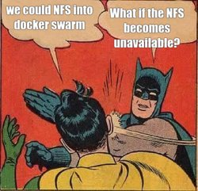
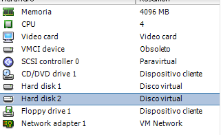
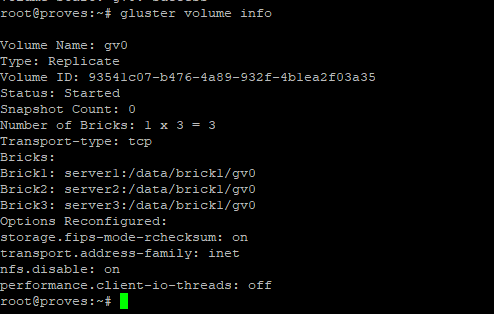
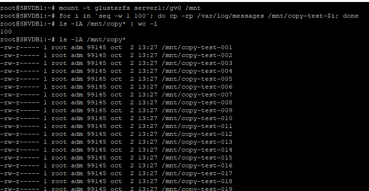
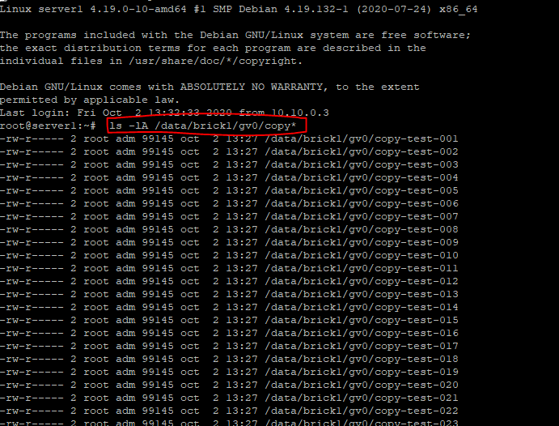

# Beggining with glusterFS

GlusterFS is a scalable network filesystem suitable for data-intensive tasks such as cloud storage and media streaming.
A big problem when we find for example, in a docker swarm is that data between it's nodes is not replicated.
 
> But we can use NFS for sharing storage! - I said to my IT partner, Edu.


The problem with NFS is that if the NFS shared is unavailable **the whole cluster can't reach that data.** So we solve a part of the problem: we have replication but not high availability.

## Let's get to work! 

So i set up a 3-node cluster just to play around and try.
Our first requirements are:
1. 3 linux machines (debian for example)
2. NTP enabled on each machine
3. a working network connection
4. At least 2 disks, one for the OS, and the other to serve GLUSTERFS


So we execute this commands in each one of the nodes to set up the second disk, assuming our disk is on /dev/sdb
```
 mkfs.xfs -i size=512 /dev/sdb
 mkdir -p /data/brick1
 echo '/dev/sdb /data/brick1 xfs defaults 1 2' >> /etc/fstab
 mount -a && mount
```

Then, install glusterfs-server on each node, and enable and start it, so it will bring the service up between reboots.
```
apt-get install glusterfs-server
systemctl enable glusterd
systemctl start glusterfs
```

When we have the same version of gluster installed, we just have to make them see each other:
```
root@server1:~# gluster peer probe server2
peer probe: success
root@server1:~# gluster peer probe server3
peer probe: success

root@proves:~# gluster peer probe server3
peer probe: success
root@proves:~# gluster peer status
Number of Peers: 2

Hostname: server2
Uuid: 466609da-ff6a-442e-b426-ed54d026e201
State: Peer in Cluster (Connected)

Hostname: server3
Uuid: cb2840a9-0ea0-40f8-83c6-90a94cc2caa8
State: Peer in Cluster (Connected)
```
Now we can assume the 3 nodes are visible from the server. It's the turn to make a volume for all the servers, so in EACH server we type:
```
mkdir -p /data/brick1/gv0
```
And then, from just **one single server** we create and start the volume like so:
```
gluster volume create gv0 replica 3 server1:/data/brick1/gv0 \\
	server2:/data/brick1/gv0 \\
	server3:/data/brick1/gv0
"volume create: gv0: success: please start the volume to access data"
gluster volume start gv0
"volume start: gv0: success"
```
We should see the volume info, from server 1.
Notice the Status "started", that means we're on a good way.


## All OK and running! let's just try if it works...

We will take another VM, outside from this infrastructure (but within the same network), to mount the gluster volume, add some data, and see if it's replicated in each host.



We can see the files are there, but what about the remote hosts?


And there it is! 
Bare in mind, that for it to work, you must have all the servers synced with NTP. 
And that's all for today 
:blush:
