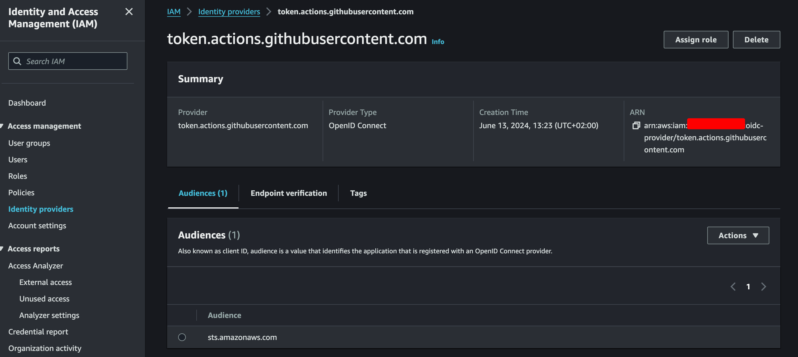

# Intro

In some pre-historic times. People created an AWS IAM account with Admin permissions and stored it's eternal-lived credentials in the repository secrets'.


Isn't a DevOps owner of his fate and seeking improving it's processes every day?  

It works! - Says the old man.  
If something is working don't touch it! - Says the IT guy.  
I am uncapable of questioning the status quo - Says the ignorant.  

I rejected all those answers... I choosed the [recommended](https://github.com/aws-actions/configure-aws-credentials/tree/v4?tab=readme-ov-file#using-this-action) way to do the things for the github runners

> [✅ Recommended] Assume Role directly using GitHub OIDC provider

In a nutshell, We create a role for the github runners to assume. And we add our needed policies to that role. In each workflow the github runner will get a short-lived session to do it's job and cease to exist.

It may sound Ironic, but in some years you will read this and it will already be outdated. Let's make a wild guess, a bet with the future. I would say the next generation of the runners will automatically select the role and the permissions based on the tasks they have. AI-powered and buzzwords alike.

FYI: This guide is intended for a result to be used with the popular [aws-actions/configure-aws-credentials](https://github.com/aws-actions/configure-aws-credentials) GHA.

## Howto

In very simple terms, it's all about a JWT (JSON Web Token).


1. In your cloud provider (AWS in this case), create an OIDC trust between your cloud role and your GitHub workflow(s) that need access to the cloud.
2. Every time your job runs, GitHub's OIDC Provider auto-generates an OIDC token. This token contains multiple claims to establish a security-hardened and verifiable identity about the specific workflow that is trying to authenticate.
3. You could include a step or action in your job to request this token from GitHub's OIDC provider, and present it to the cloud provider.
4. Once the cloud provider successfully validates the claims presented in the token, it then provides a short-lived cloud access token that is available only for the duration of the job.

We can check the github OIDC configuration with the <https://token.actions.githubusercontent.com/.well-known/openid-configuration> URL.

### Configure AWS

Feel free to follow both guides in parallel

1. https://docs.aws.amazon.com/IAM/latest/UserGuide/id_roles_providers_create_oidc.html#manage-oidc-provider-console
2. https://docs.github.com/en/actions/security-for-github-actions/security-hardening-your-deployments/configuring-openid-connect-in-amazon-web-services#adding-the-identity-provider-to-aws

Once we have configured our OIDC provider, and set the right audience (the Audience is the consumers of the github-generated JWT, in this case `sts.amazonaws.com`) we will see our Identity Provider like this in AWS.


Then we can create a role, in this example `GithubRunners`, in this role we will attach the permissions that our pipelines need. Usually push permissions to ECR, but could be upload a file to S3 or whatever suits your needs.


The important part is the trust relationship with this role. Where in the `sub` field there must be as much repositories and environments with the granularity you desire, wildcards are allowed if we want to apply the permissions to all different kinds of environments. It has to ressemble this block.

```json
{
    "Version": "2012-10-17",
    "Statement": [
        {
            "Effect": "Allow",
            "Principal": {
                "Federated": "arn:aws:iam::xxxxxxx:oidc-provider/token.actions.githubusercontent.com"
            },
            "Action": "sts:AssumeRoleWithWebIdentity",
            "Condition": {
                "StringEquals": {
                    "token.actions.githubusercontent.com:aud": "sts.amazonaws.com"
                },
                "StringLike": {
                    "token.actions.githubusercontent.com:sub": [
                        "repo:OWNER/REPOSITORY:environment:NAME",
                    ]
                }
            }
        }
    ]
}
```

### Last steps

After the previous steps you only need to adjust your Github Actions workflow YAML file.

#### 1. Set your permissions

you can set it at the step, job or workflow level. But be sure to have this two fields:

```yaml
permissions:
  id-token: write # This is required for requesting the JWT
  contents: read  # This is required for actions/checkout
```

#### 2. Reference the ROLE ARN in the step

It is recommended to use the official action, and of course pin it to a version/tag, in this case we can add:

```yaml
- name: 🔑 Configure AWS credentials
  uses: aws-actions/configure-aws-credentials@v4
  with:
    role-to-assume: arn:aws:iam::XXXXXXXXXXXX:role/GithubRunners
    aws-region: $MY_REGION
```

And that's all you need. Ooofff how many things and I am a lazy bastard. Isn't this already in a terraform module?

## TL;DR

I've created a terraform module for this and it's publicly available at <https://registry.terraform.io/modules/blueprismo/github-oidc-provider/aws/latest>

Feel free to play with it!

And it's getting late, today I thought about my idea of resting. I have a completely wrong conception of "resting", resting should not be a reward, it is a right and even a routine to refresh and keep your batteries charged. When resting becomes a need, it means I had some possibly bad priorizations :tongue:

See you next time!
