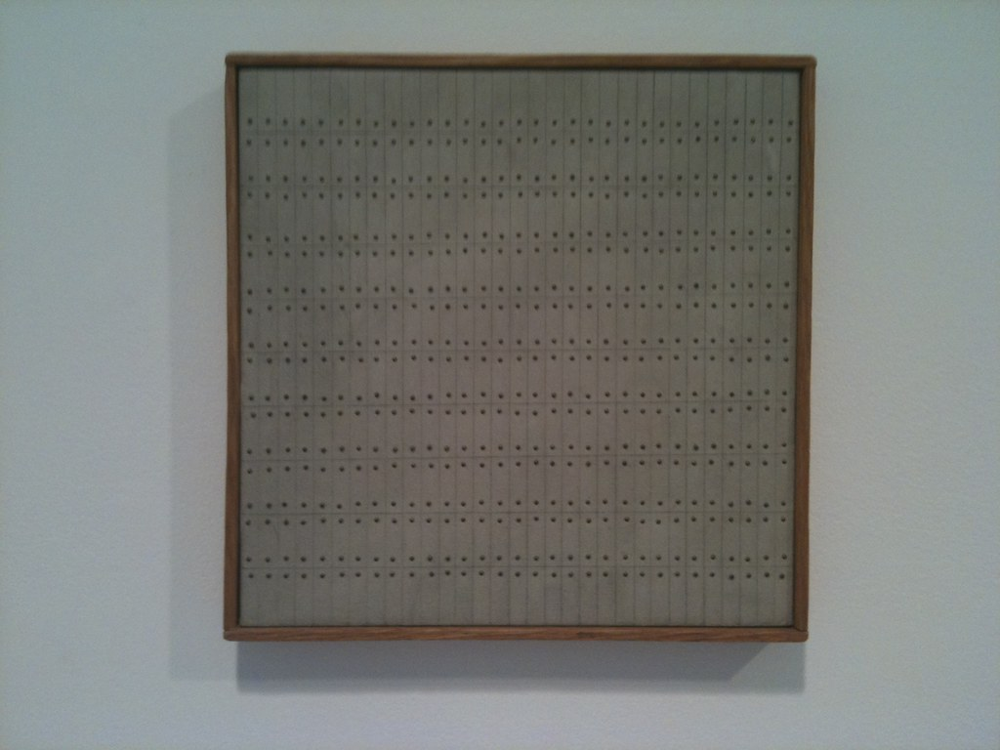

# Intro

Today I'm going to do some research on the golang [dynamic client](https://pkg.go.dev/k8s.io/client-go/dynamic)
If you are developing kubernetes aplications you might have used it before.

## What is the dynamic client

The dynamic client is a generic, runtime-based client for interacting with any Kubernetes resource — including custom resources (CRDs) — without needing generated Go types.

There are other go clients to interact with k8s, the benefit of the dynamic client is that you don't depend on a predefined data structure, or as Frank Sinatra said _In other words_ when you don't care or know the objects you are interacting with.

1. The typed clients (like `kubernetes.Clientset`) work only with built-in API types defined in code (corev1.Pod, apps/v1.Deployment, etc.).
2. The controller-runtime client works with typed structs that implement `runtime.Object`.
3. The dynamic client works with unstructured JSON objects (wrapped in `*unstructured.Unstructured`), using the resources GroupVersionResource (GVR) instead of Go structs. <- This is the one I'm writing about today.

## Diving deeper

But, how it is wired in the inside?
The main entrypoint can be found on the [interface](https://github.com/kubernetes/client-go/blob/6661e485ecc691ff868672f6d92b31c5aca86a4b/dynamic/interface.go#L29-L31) package.

```go
type Interface interface {
  Resource(schema.GroupVersionResource) NamespaceableResourceInterface
}
```

You call `Resource(GVR)` and get back something that you can (or not) scope to a namespace.
For those who don't know, ALL (absolutely ALL!) Kubernetes resrouce types are defined with the [GVR](https://pkg.go.dev/k8s.io/apimachinery/pkg/runtime/schema#GroupVersionResource) triplet which consists of `Group`, `Version`, `Resource`.

Here's a table with some examples of GVRs:

| Kubernetes Kind                | Group                        | Version | Resource (plural)                 | GVR                                                                                              |
| ------------------------------ | ---------------------------- | ------- | --------------------------------- | ------------------------------------------------------------------------------------------------ |
| Pod                            | (empty, “core”)              | v1      | `pods`                            | `Group:"", Version:"v1", Resource:"pods"`                                                        |
| Deployment                     | apps                         | v1      | `deployments`                     | `Group:"apps", Version:"v1", Resource:"deployments"`                                             |
| Secret                         | (empty)                      | v1      | `secrets`                         | `Group:"", Version:"v1", Resource:"secrets"`                                                     |
| ValidatingWebhookConfiguration | admissionregistration.k8s.io | v1      | `validatingwebhookconfigurations` | `Group:"admissionregistration.k8s.io", Version:"v1", Resource:"validatingwebhookconfigurations"` |

You get the drill :wink:

Another way to interpret it is through the URI we're interacting with:

```go
/apis/<group>/<version>/<resource>  // (for non-core groups)
/api/<version>/<resource>           // (for core v1)

// Then the dynamic client does:
dyn.Resource(schema.GroupVersionResource{
  Group: "apps", Version: "v1", Resource: "deployments",
})
// to talk to /apis/apps/v1/deployments
```

Calling Resource(GVR) returns a handle for that resource; you can optionally scope it with .Namespace(...) for namespaced types

```go
// NamespaceableResourceInterface
type NamespaceableResourceInterface interface {
  Namespace(string) ResourceInterface
  ResourceInterface // for cluster-scoped access
}
```

And that [ResourceInterface](https://github.com/kubernetes/client-go/blob/6661e485ecc691ff868672f6d92b31c5aca86a4b/dynamic/interface.go#L33-L45) has some kubernetes object operations ([CRUD](https://en.wikipedia.org/wiki/Create,_read,_update_and_delete) and more):

```go
type ResourceInterface interface {
  Create(ctx context.Context, obj *unstructured.Unstructured, options metav1.CreateOptions, subresources ...string) (*unstructured Unstructured, error)
  Update(ctx context.Context, obj *unstructured.Unstructured, options metav1.UpdateOptions, subresources ...string) (*unstructured Unstructured, error)
  List(ctx context.Context, opts metav1.ListOptions) (*unstructured.UnstructuredList, error)
  Watch(ctx context.Context, opts metav1.ListOptions) (watch.Interface, error)
  [...]
```

Notice the `*unstructured.Unstructured` type.

## The problem

This may feel like we are overengineering, there's beauty in simplicity, like in this painting of Agnes martin (untitled)



Why do we even need this? Why do we exist? What problems is it trying to solve? Will my life end soon?

The real problem is that we **DO NOT ALWAYS KNOW** our go types at compile time!

### When things go smoothly 🥤

Imagine we are using the corev1 library to define/refer a [pod](https://pkg.go.dev/k8s.io/api/core/v1#Pod)

```go
pod := &corev1.Pod{}
pod.Name = "my-pod"
```

Simple, we're done and we can interact with it as it's a predefined struct.

### When things get complex 🥵

Universe tends to chaos, I love that, please universe don't change (hehe)

For arbitrary objects there's no Go struct. So instead of generating types dynamically (which Go can't do), Kubernetes uses a [map](https://github.com/kubernetes/apimachinery/blob/master/pkg/apis/meta/v1/unstructured/unstructured.go#L41-L46).

`unstructured.Unstructured` is just a thin struct that wraps that `map[string]interface{}` — basically a JSON object in Go form.

```go
type Unstructured struct {
  Object map[string]interface{}
}
```

The call hierarchy would be something like this one:

```sh
dynamic.Interface
   → Resource(GVR)
        → Namespace("default")
             → ResourceInterface methods (CRUD, Watch, etc.) # Here is where unstructured shines
```

#### Demo time

For demonstration sake, let's create a some elements

##### map -> unstructured

Bear in mind there are no typed structs, no imports from `core/v1`

```go
package main

import (
  "fmt"
  "k8s.io/apimachinery/pkg/apis/meta/v1/unstructured"
)

func main() {
  // Create a Kubernetes object dynamically
  obj := &unstructured.Unstructured{
    Object: map[string]interface{}{
      "apiVersion": "v1",
      "kind":       "Pod",
      "metadata": map[string]interface{}{
        "name": "demo-pod",
      },
      "spec": map[string]interface{}{
        "containers": []interface{}{
          map[string]interface{}{
            "name":  "nginx",
            "image": "nginx:latest",
          },
        },
      },
    },
  }
  
  // It behaves like a regular runtime.Object (has metadata methods)
  fmt.Println("Name:", obj.GetName())              // demo-pod
  fmt.Println("Kind:", obj.GetKind())              // Pod
  fmt.Println("API Version:", obj.GetAPIVersion()) // v1

  // You can read arbitrary fields at runtime
  spec := obj.Object["spec"].(map[string]interface{})
  containers := spec["containers"].([]interface{})
  first := containers[0].(map[string]interface{})
  fmt.Println("Container image:", first["image"])
}
```

That's it you have a complete Kubernetes object represented as a Go map, but still accessible through convenient helper methods (`GetName()`, `SetNamespace()`, etc.)

##### yaml -> unstructured

```go
var u unstructured.Unstructured
_ = yaml.Unmarshal([]byte(`
apiVersion: v1
kind: Pod
metadata:
  name: demo-pod
spec:
  containers:
  - name: nginx
    image: nginx:latest
`), &u.Object)
```

Here we can just create a pod from a yaml encoded element, now we can use the `u` variable to interact with that k8s resource!

### What do we solve

Thanks to the `unstructured.Unstructured` type, we can, amongst other things:

- Decode any YAML into an Unstructured.
- Modify or inspect it using standard Go types.
- Send it to the API server with the dynamic client.

Thanks for reading until here 😃! Hope you have learned something, peace.
