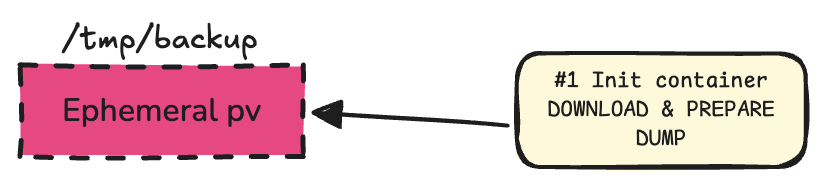

# Intro

In the grand scheme of entropy, delaying the inevitable is an art. Today’s masterpiece? Wrangling an ephemeral volume for a database backup.  

Today's challenge is to prepare/tamper a database before it boots up with a special requirement, **the input size of that backup is _undetermined_**: we don't know the input! (different from **_non-deterministic_**, which means the output of a system is unpredictable and varies due to randomness).

As we don't know the size, we will create an ephemeral storage to prepare that step, and once the backup has been succesfully restored our driver will be able to delete it. The feature we are going to use to acheive this goal is called [Ephemeral Volumes](https://kubernetes.io/docs/concepts/storage/ephemeral-volumes/) and has been in Kubernetes since version 1.23

In order to check if your CSI (Container Storage Interface) driver supports ephemeral volume allocation, you can refer to [the CSI Interest group list](https://kubernetes-csi.github.io/docs/drivers.html). In this post the `ebs.csi.aws.com` is going to be used.

## Hands on

An initContainer will be the resource containing the workload, because we need to do the tampering before the main database container starts and this way everything will be automatically discarded.



The `/tmp/backup` folder will be our workspace, so we have to specify:

```yaml


```