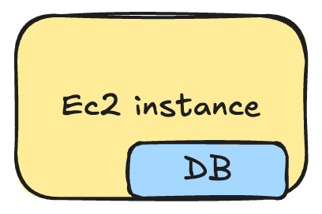
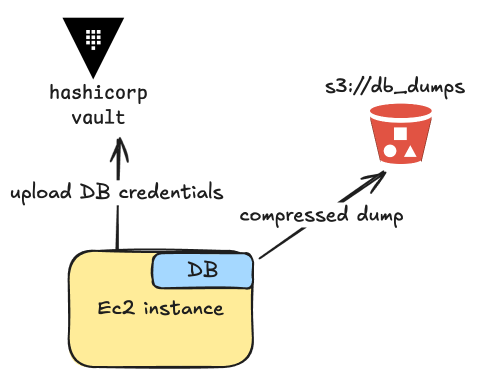
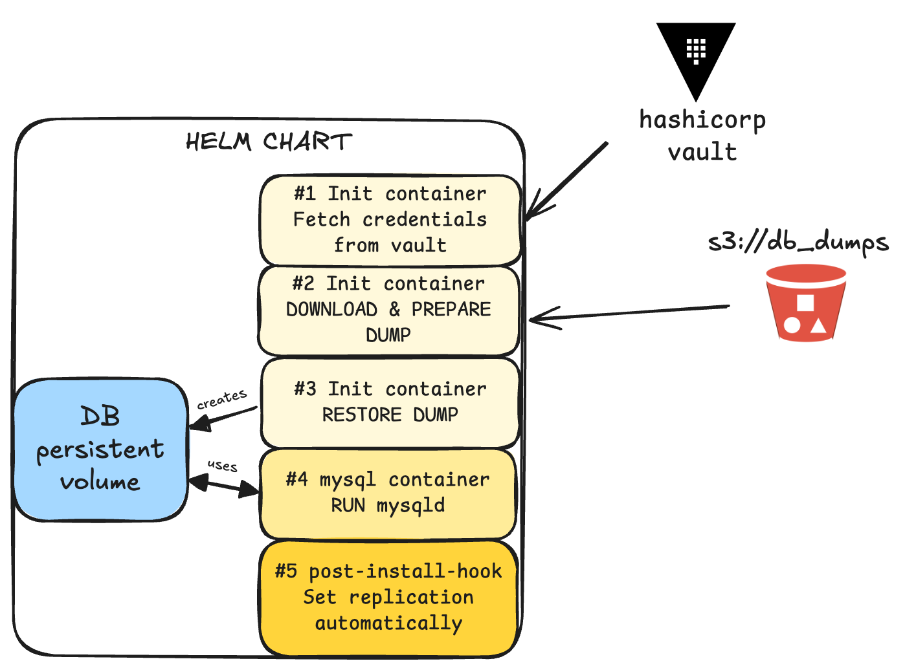
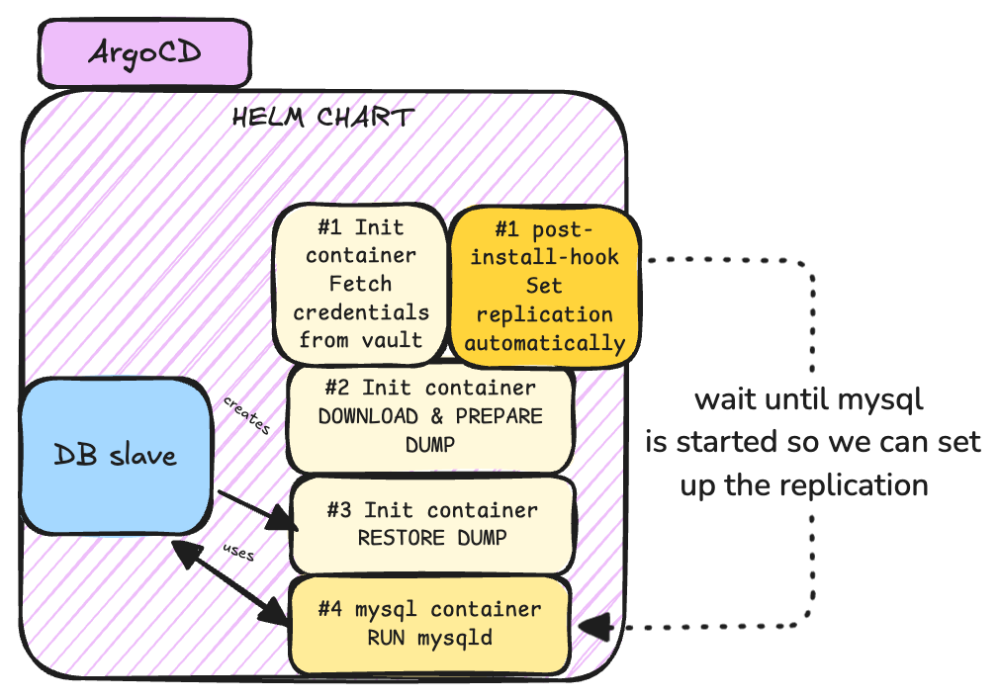
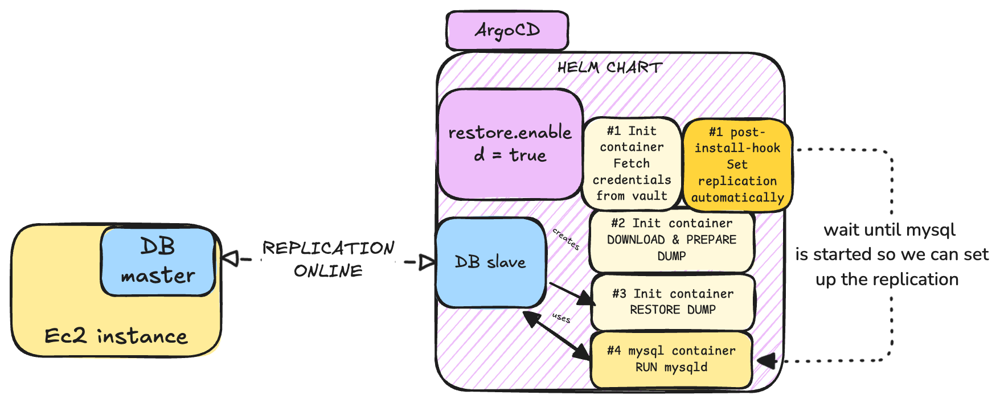

# Intro

Let's write about 0 downtime database movements, let's say we want to streamline a process to move a database (mysql) from an ec2 instance to a kubernetes cluster in another AWS account. Without downtime.

I will use GTIDs just for the fun sake of it. Let's always [RTFM](https://dev.mysql.com/doc/refman/8.0/en/replication-gtids-howto.html)

I have this initial state:


## TLDR

In short, our steps should be as follows:

1. Configure origin mysql server to allow GTID replication (consistency is a MUST).
2. Set up a peering connection between the AWS accounts.
3. Perform a hot-backup with percona xtrabackup for an initial dump.
4. Stream upload the backup to an s3 bucket.
5. Upload credentials in hashicorp vault.
6. Deploy an application template in argoCD.
7. Instruct the replica to use the origin as the replication data source and to use auto-positioning.

## Hands on

### Step 1: Prepare origin DB

In this step we will prepare the origin DB, upload the credentials to hashicorp Vault and upload the hot-backup to s3.


We want to ensure seamless replication, so there is no risk of data loss and the master and the replica are always in sync. This is why we choose to use GTID-based replication.
If GTID is not enabled before taking the dump:

- The transactions in the dump will not have GTID information.
- The replica cannot use GTID-based replication, as GTIDs are not recorded in the source's binary logs for those transactions.

To check if GTIDs are enabled in our servers we can check with the mysql command `SHOW VARIABLES LIKE 'gtid_mode';`

We must set both variables `enforce_gtid_consistency` and `gtid_mode` to `ON`.  
> FYI: the `mysql.gtid_executed` system table is used to preserve the assigned GTIDs of all the transactions applied on a MySQL server, except those that are stored in a currently active binary log file. This table is used to preserve GTID history even after binary logs are deleted.

```mysql
mysql>  SHOW VARIABLES LIKE 'log_bin';
+---------------+-------+
| Variable_name | Value |
+---------------+-------+
| log_bin       | ON    |
+---------------+-------+

mysql> SHOW VARIABLES LIKE 'gtid_mode';
+---------------+-------+
| Variable_name | Value |
+---------------+-------+
| gtid_mode     | ON    |
+---------------+-------+

mysql> describe mysql.gtid_executed;
+----------------+----------+------+-----+---------+-------+
| Field          | Type     | Null | Key | Default | Extra |
+----------------+----------+------+-----+---------+-------+
| source_uuid    | char(36) | NO   | PRI | NULL    |       |
| interval_start | bigint   | NO   | PRI | NULL    |       |
| interval_end   | bigint   | NO   |     | NULL    |       |
+----------------+----------+------+-----+---------+-------+
```

Once the origin server is configured, we can make an initial dump with percona xtrabackup.
The documentation specifies to use xbcloud binary to upload data directly into s3, but as I want a single compressed file I will do it on my own, a single compressed file is easier to handle as it's only one object, you can access it's metadata without any additional requests and it simplifies streamlining the process.

```bash
docker run --rm --name pxb -it --user root \
    -v /var/lib/mysql:/var/lib/mysql \
    -v /var/run/mysqld/mysqld.sock:/var/run/mysqld/mysqld.sock \
    percona/percona-xtrabackup:8.0 \
    /bin/bash -c \
    "xtrabackup --backup --stream --datadir=/var/lib/mysql/ --user root --compress --compress-zstd-level=1 --socket /var/run/mysqld/mysqld.sock | aws s3 cp - s3://dbmigration/mysql.xbstream.zst"
```

After this dump, we are going to upload it into a new s3 bucket just in case we would like to streamline this process and automate it. To do so we will upload a policy into the instance profile of our ec2 instance.

After this, we need to ensure this s3 bucket from our account has access from the destination account where our EKS cluster will be.
In order to quickly and dirty prepare cross-account access to our s3 bucket only for download (read) we will need this policy:

```json
{
    "Version": "2012-10-17",
	"Statement": [
		{
			"Sid": "Allow access from ACCOUNT_B",
			"Principal": {
			    "AWS": "arn:aws:iam::<ACCOUNT_B>:root"
			},
			"Effect": "Allow",
			"Action": [
			    "s3:ListBucket",
			    "s3:GetObject",
                "s3:GetObjectVersion"
			],
			"Resource": [
			    "arn:aws:s3:::<BUCKET_A>",
			    "arn:aws:s3:::<BUCKET_A>/*"
			]
		}
	]
}
```

We can test so with simple commands locally:

```sh
❯ aws s3 ls --profile account-b s3://bucket_a
2025-01-10 12:54:42          0 testfile
❯ aws s3 cp --profile account-b s3://bucket_a/testfile .
download: s3://bucket_a/testfile to ./testfile
```

But we want to access them through kubernetes, therefore IRSA comes into the game, with the following policy:

```json
### Main policy 
{
    "Version": "2012-10-17",
    "Statement": [
        {
            "Sid": "Allow RW bucket",
            "Effect": "Allow",
            "Action": "s3:*",
            "Resource": "arn:aws:s3:::temp-sre-db-migration"
        }
    ]
}

### Trust policy:
{
    "Version": "2012-10-17",
    "Statement": [
        {
            "Sid": "",
            "Effect": "Allow",
            "Principal": {
                "Federated": "arn:aws:iam::ACCOUNT_B:oidc-provider/oidc.eks.eu-central-1.amazonaws.com/id/xxx"
            },
            "Action": "sts:AssumeRoleWithWebIdentity",
            "Condition": {
                "StringLike": {
                    "oidc.eks.eu-central-1.amazonaws.com/id/xxx:aud": "sts.amazonaws.com",
                    "oidc.eks.eu-central-1.amazonaws.com/id/xxx:sub": "system:serviceaccount:*:*"
                }
            }
        }
    ]
}
```

### Set up helm chart

A helm chart will be deployed with the following containers


The start up will be in this sequence:

1. Fetch DB credentials from vault
2. Download and prepare percona xtrabackup
3. Restore xtrabackup into a new Persistent Volume
4. Run mysql
5. Set replication automatically

Well... I lied to you a little, in reality, the post-install hook is always executed after the helm installation (this is by design), so I crafted the hook to have a retry loop that will wait until the database is up & running before setting the replication automatically.



The script is basically something like this

```bash
MAX_RETRIES=10
RETRY_DELAY=60
RETRY_COUNT=0

check_mysql_connection() {
  timeout 5 bash -c "echo > /dev/tcp/$MYSQL_SERVICE_HOST/3306" && echo "Connected" || return 1
}

while [ $RETRY_COUNT -lt $MAX_RETRIES ]; do
  if check_mysql_connection; then
    # Connection successful, proceed with replication change
    source /vault/secrets/database-config.txt
    mysql -u "$DB_REPLICATION_USER" -h "$MYSQL_SERVICE_HOST" -p"$DB_REPLICATION_PASSWORD" -e "
      CHANGE REPLICATION SOURCE TO
      SOURCE_HOST='$SOURCE_HOST_IP',
      SOURCE_PORT=3306,
      SOURCE_USER='$DB_REPLICATION_USER',
      SOURCE_PASSWORD='$DB_REPLICATION_PASSWORD',
      SOURCE_AUTO_POSITION=1;
      START REPLICA;
    "
    # Ensure replication is properly set
    REPLICA_STATUS=$(mysql -u "$DB_REPLICATION_USER" -h "$MYSQL_SERVICE_HOST" -p"$DB_REPLICATION_PASSWORD" -e "SHOW REPLICA STATUS\G" | grep "Replica_IO_Running: Yes")
    if [[ -n "$REPLICA_STATUS" ]]; then
        echo "Replication ONLINE" && exit 0
    else
        echo "Replication FAILING" && exit 1
    fi
  else
    # Connection failed, retry after delay
    RETRY_COUNT=$((RETRY_COUNT + 1))
    echo "Retry $RETRY_COUNT of $MAX_RETRIES: MySQL not ready. Waiting $RETRY_DELAY seconds before retrying..."
    sleep $RETRY_DELAY
  fi
done
# all retries failed
echo "MySQL connection failed after $MAX_RETRIES retries."
exit 1
```

As the container does not have curl, wget, netcat or any other network tool, I will use the `/dev/tcp` special linux device to ping the 3306 port. This will be our connection to test wether mysql has started or not.

The first payload:

```mysql
CHANGE REPLICATION SOURCE TO
  SOURCE_HOST='$SOURCE_HOST_IP',
  SOURCE_PORT=3306,
  SOURCE_USER='$DB_REPLICATION_USER',
  SOURCE_PASSWORD='$DB_REPLICATION_PASSWORD',
  SOURCE_AUTO_POSITION=1;
```

Is to specify the parameters to where to connect in order for the master server to send data, and the key here is the `SOURCE_AUTO_POSITION` setting. Setting this option makes the source respond by sending all transactions recorded in its binary log whose GTID is not included in the GTID set sent by the replica [(sauce)](https://dev.mysql.com/doc/mysql-replication-excerpt/8.0/en/replication-gtids-auto-positioning.html).

After the replication has been done, we would have something like this:


And of course, as we had in mind streamlining the whole process with Ansible, we can then add our own microservice (like an instance-manager) to control the lifecycle of the instances:


In some future steps, we can prepare some other automation to swap the master and the replica roles.

And that was yet another task in a day of an SRE/DevOps/OneManArmy. The learnings for today in a non-exhaustive list are:

- Now you should know how one way to set streaming replication for mysql
- What are GTIDs
- Almost everything can be automated
- Post-install helm hooks run always after installation, they are reckless and do not care about init processes
- `/dev/tcp` may be handy in containers without standard network tools
- S3 buckets cross account replication
- IRSA is (IMHO) still better than EKS Pod Identity

Hope you have a great one! Remember to seek mental peace :lotus_position: