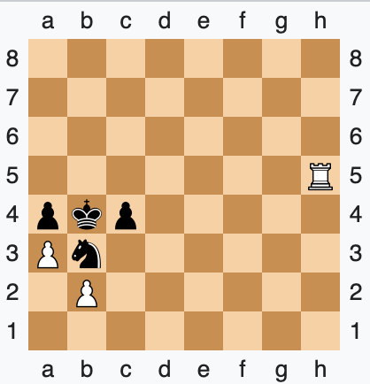

# Job offers disclaimer

I am aware that some information during hiring processes are top secret! Will try to keep it like that, but in any case life itself is a joke, and as nobody reads this blog with too much seriousness, and I hope it keeps like that.  

There comes a day in your life that something pushes you out of your current context, apathy, boredom, test your free will, could be a large list!
In some of those cases, people can get curious about whether their work may be also valued elsewhere. Am I still a pawn in this game?
Pawns can also deliver [checkmates](https://en.wikipedia.org/wiki/Checkmate_pattern#Pawn_mate_\(David_and_Goliath_mate\))

Above, `a3++` ended the game

We are too many people in this world, and people lie a lot in their resume. There is the story of the *Chauffeur knowledge*:
>I frequently tell the apocryphal story about how Max Planck, after he won the Nobel Prize, went around Germany giving the same standard lecture on the new quantum mechanics.  
>
>Over time, his chauffeur memorized the lecture and said, “Would you mind, Professor Planck, because it’s so boring to stay in our routine. [What if] I gave the lecture in Munich and you just sat in front wearing my chauffeur’s hat?” Planck said, “Why not?” And the chauffeur got up and gave this long lecture on quantum mechanics.  
>
>After which a physics professor stood up and asked a perfectly ghastly question.  
>The speaker said, “Well I’m surprised that in an advanced city like Munich I get such an elementary question. I’m going to ask my chauffeur to reply.”  

There are lot of outstanding engineers out there (like Romans Krjukovs or Bill Kalaitzis), some average ones (like me) and lots of fake prophets feeded with buzzwords in their mouths, ready to be puked in front of some HR interview! Let's get started!

## Laugh at cringedin

In the sad world of today we rely on linkedin for business connections.
I once had such a message:  

Seems nice, I got reached for a job offer in LinkedIn and I agreed on a first talk. Just out of curiosity, I went to that company webpage and applied with the same CV for the same role.  
Well, who would have guessed? An automated rejection appeared in my mailbox

After meeting Melissa (we had a nice life talk!) and explaining this cumbersome mail rejection, she just admitted
> "There are too many applicants, and most of them are automatically rejected by some filters". 

Cannot blame her, we are all gears of a bigger system.

## Amazing! Not Amazon

So I had a round of interviews with Amazon, a big tech giant.
They were trying to fulfill a position for a "Sovereign Cloud in Europe", the project looks promising, it seems the GOLIVE phase is in 8 months. So my curiosity began to kick in and I asked some questions (the following is a non-exhaustive list)

- What is expected of me in this project?
- Could you [metaphorically] explain me how is a normal day in this job?
- What is the current state of the project?
- What is the adverted salary strip for this role?
- Is there possibility for relocation?

All the answers were ambiguous, unclear or rejected (which I interpret as lack of transparency or knowledge)

Then we jumped into a scripting test, as I never use any chatGPT or google dork during the interview because the first person who I would be fooling is not the interviewer but me, the following result came out the question "Write a script that pings all hosts in X subnet, bonus points if you log the results".

My train of thought was exposed in the comments, as I exposed my interviewer if I was allowed to do so:

I was a bit unhappy with the results as there were some syntax errors, but take it as pseudo-code.  
After that, there were 4 more interviews of 1 hour each, explaining life-situations.  
And on top of that a final one, to get more technical questions which IMHO were basic SSH questions (private and public key permissions, which port it connects to, types of keys, etc.)

After at least 5 more interviews, the final review was assessed:
"We cannot say the reasons due to legal reasons, but the offer is rejected"

As 2B would say

It is a pitty the lack of information provided in some interviews, luckily worth is measured with kindness for me, so that is alright.

## Conclusions

Instead of blaming the world from a mysanthropist point of view, It would be really nice if interview processes had:

1. More human touch, not being a chunk of memory always in-transit
2. Honest feedback, companies claim to forest transparency, but lack at provide interview feedback or salary ranges (luckily this will be solved in EU by european parliament (UE) 2023/970)
3. Empathy, everybody have bad days. Understanding this can bring interviewers a step closer to being human
4. Babysitting the process. There are millions of candidates and attenting on time the scheduled calls is a very good idea.

Have a wonderful day ahead, and remember to have fun with whatever you are doing!
:smile:
