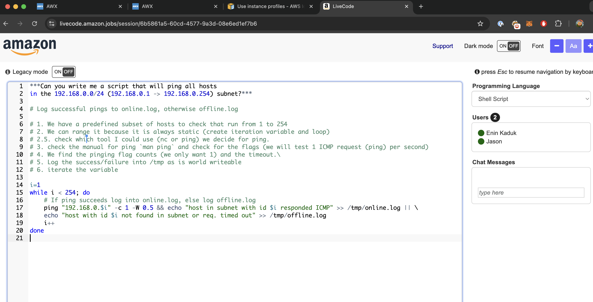

# Job offers disclaimer

I am aware that some information during hiring processes are top secret! Will try to keep it like that, but in any case life itself is a joke, and as nobody reads this blog with too much seriousness, and I hope it keeps like that.  

There comes a day in your life that something pushes you out of your current context, apathy, boredom, test your free will, could be a large list!
In some of those cases, people can get curious about whether their work may be also valued elsewhere. Am I still a pawn in this game?
Pawns can also deliver [checkmates](https://en.wikipedia.org/wiki/Checkmate_pattern#Pawn_mate_\(David_and_Goliath_mate\))

Above, `a3++` ended the game

We are too many people in this world, and people lie a lot in their resume. There is the story of the *Chauffeur knowledge*:
>I frequently tell the apocryphal story about how Max Planck, after he won the Nobel Prize, went around Germany giving the same standard lecture on the new quantum mechanics.  
>
>Over time, his chauffeur memorized the lecture and said, “Would you mind, Professor Planck, because it’s so boring to stay in our routine. [What if] I gave the lecture in Munich and you just sat in front wearing my chauffeur’s hat?” Planck said, “Why not?” And the chauffeur got up and gave this long lecture on quantum mechanics.  
>
>After which a physics professor stood up and asked a perfectly ghastly question.  
>The speaker said, “Well I’m surprised that in an advanced city like Munich I get such an elementary question. I’m going to ask my chauffeur to reply.” 

There are lot of outstanding engineers out there (like Romans Krjukovs or Bill Kalaitzis), some average ones (like me) and lots of fake prophets feeded with buzzwords in their mouths, ready to be puked in front of some HR interview! Let's get started!

## Laugh at cringedin

In the sad world of today we rely on linkedin for business connections.
I once had such a message:  

Seems nice, I got reached for a job offer in LinkedIn and I agreed on a first talk. Just out of curiosity, I went to that company webpage and applied with the same CV for the same role.  
Well, who would have guessed? An automated rejection appeared in my mailbox

After meeting Melissa (we had a nice life talk!) and explaining this cumbersome mail rejection, she just admitted
> "There are too many applicants, and most of them are automatically rejected by some filters". 

Cannot blame her, we are all gears of a bigger system.

## Amazing! Not Amazon

So I had a round of interviews with Amazon, a big tech giant.
They were trying to fulfill a position for a "Sovereign Cloud in Europe", the project looks promising, it seems the GOLIVE phase is in 8 months. So my curiosity began to kick in and I asked some questions (the following is a non-exhaustive list)

- What is expected of me in this project?
- Could you [metaphorically] explain me how is a normal day in this job?
- What is the current state of the project?
- What is the adverted salary strip for this role?
- Is there possibility for relocation?

All the answers were ambiguous, unclear or rejected (which I interpret as lack of transparency or knowledge)

Then we jumped into a scripting test, the following result came out the question "Write a script that pings all hosts in X subnet, bonus points if you log the results".

My train of thought was exposed in the comments, as I exposed my interviewer if I was allowed to do so:

I was a bit unhappy with the results as there were some syntax errors, but take it as pseudo-code.  
After that, there were 4 more interviews of 1 hour each, explaining life-situations.  
And on top of that a final one, to get more technical questions which IMHO were basic SSH questions (private and public key permissions, which port it connects to, types of keys, etc.)

After at least 5 more interviews, the final review was assessed:
"We cannot say the reasons due to legal reasons, but the offer is rejected"

As 2B would say

It is a pitty the lack of information provided in some interviews, luckily worth is measured with kindness for me, so that is alright.

## Contentful

Contentful is a headless CMS, I did the interview while climbing in the forest, the interviewer, Andreea Tilvan was very comprehensive, the conversation was smooth and it was that: a conversational interview. Sadly she told me there was one person further than me in the process, and that person got the job, lucky him/her! Either way the intervirew was cool, I felt like this:

## Elastic

This interviewer, Ferran San Millan, was also from near my hometown (Girona) and we did half of the interview in Catalan. Sadly the position was quickly fulfilled before I could do any code or skills test. It killed me the vague hope in regards of getting hired.

Nevertheless, he is a friendly guy that takes importance into listening to people. Enjoyed the time with him!

## n8n

N8n is a "no-code" platform for automating stuff, seems a cool open source project which is very very trendy nowadays.

Did a couple of rounds, I really enjoyed the technical interview, the setting was a game of cards where it represented a circular graph of 6 kings. Each king having some "score/life" points that were subtracted through a dice roll.

I tend to express my train of thought while doing the exercise, and I was back and forth quite a lot, that insecurity made me loose some time and clarity towards bringing a solution. The examinator smelled that, and maybe that is the reason I finally got rejected. Overall the exercise was one of the funniest I ever did in an interview, I like how playful it was.

## Docker

Damn, Docker is one technology I trully love, my first interview was with Gauri Razdan, a wonderful woman based in California. The interview was at the end of my european day on a Friday. The talk was smooth, and the destination for the project is Docker DHI ([Docker Hardened Images](https://www.docker.com/blog/introducing-docker-hardened-images/)), they look for a stereotypical devops role, a fellow that knows in all sectors. I think I could be a great fit! Let's see how it goes.

**Interview #2** was a bit disastrous, there was a graphql exercise which I admitted it's been a while since I don't tamper with it, and couldn't finish on time. I punish myself and the voices in my head tell me bad things, luckily there is a third interview tomorrow. The guy was very comprehensive and empathetic. Kudos for his human behaviour <3

**Interview #3** was pure poetry. The exercise given was smoothly done, with some quick stackoverflow help for some bash syntax tips. No GPTs or generated crap, all from carbon-based intelligence. After the test we had a casual chat. I admitted not knowing about provenance files in detail, and being ignorant in some other topics.

**Interview #4** was with an Engineering Manager. That man was with the big players, he told me he worked with the creator of [SpringBoot](https://spring.io/projects/spring-boot) and he's been more than 20 years in business (I'm 26 as the time of writing this, so that puts some perspective). Talk was very conversational, he even knew the place I grew on as he was a biker aswell.

**Interview #5** was with a VP of Product. An american programmer that shifted into the "political role" because he experienced shitty Project Managers in his life, and just wanted to make the engineers not experience that pain. Mad respect 🫡 I felt the time was limited and would have loved to talk more with him. After this... silence, they would provide a final conclusion by end of week.

**The job offer is here!** I am excited to announce I will join Docker in my next career step!

## Conclusions

Instead of blaming the world from a mysanthropist point of view, It would be really nice if interview processes had:

1. More human touch, not being a chunk of memory always in-transit
2. Honest feedback, companies claim to forest transparency, but lack at provide interview feedback or salary ranges (luckily this will be solved in EU by european parliament [(UE) 2023/970](https://eur-lex.europa.eu/eli/dir/2023/970/oj/eng))
3. Empathy, everybody have bad days. Understanding this can bring interviewers a step closer to being human
4. Babysitting the process. There are millions of candidates and attenting on time the scheduled calls is a very good idea.

Have a wonderful day ahead, and remember to have fun with whatever you are doing!
:smile:
