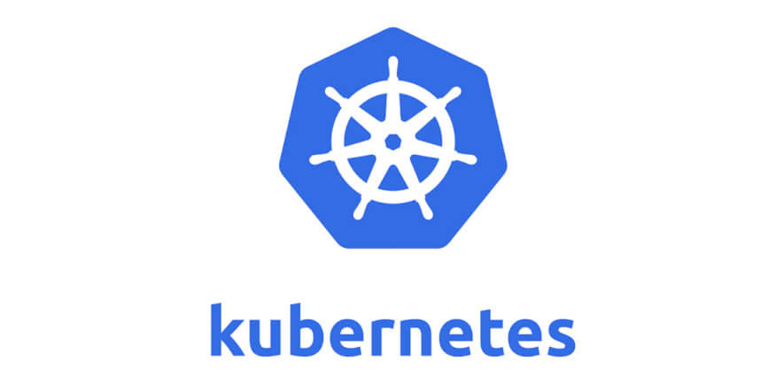
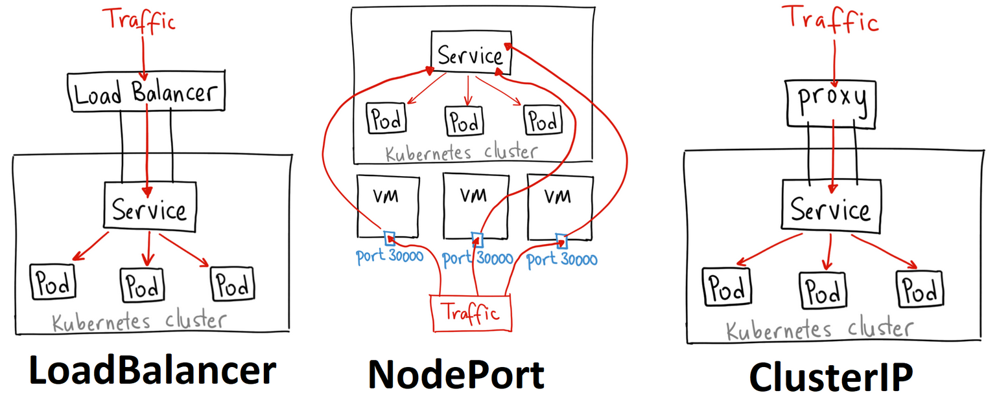
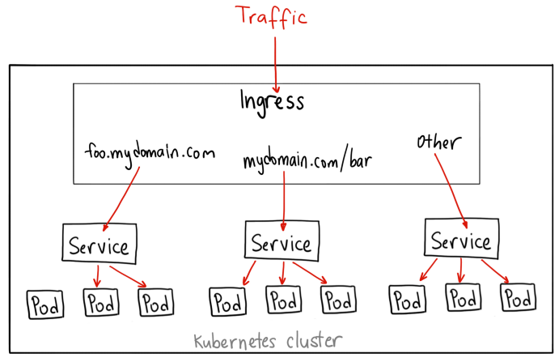
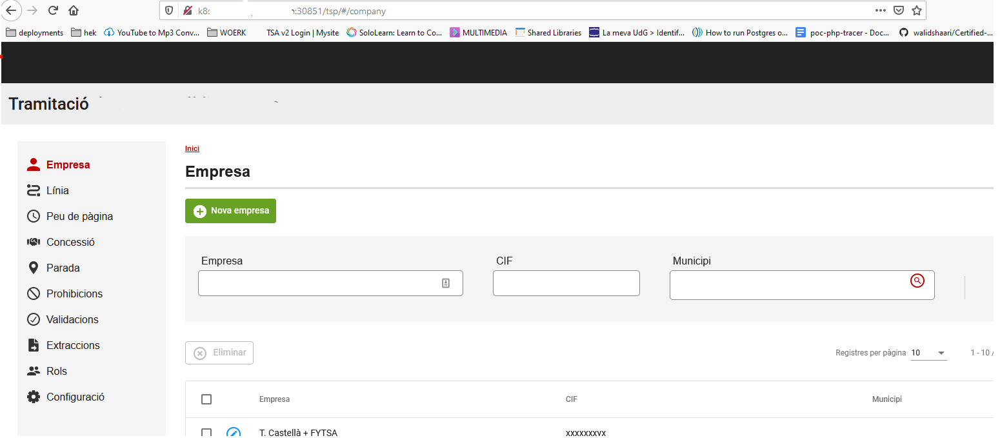

# Brief introduction
I once heard kubernetes is like teenage sex, everybody talks about it, you think people around you do it a lot, but nobody really knows how it is properly done.
So at my job I was asked if I would join to discover a way to deploy something with this new technology: Kubernetes.

Kubernetes (or k8s for short) is an opensource platform that allows you to manage/orchestrate containers in a versatile way, with functions like auto-scaling, rollback when an automated-deploy is not mounted, etc.
The project was originally from google and has revealed it to the world back in 2014.

There are a bunch of things you should know before diving into the depths of k8s, like what is a pod, what is a volume claim, kubernetes services, deployments, ingress, ingress-controllers and more cool words like those! :smile:
I'll make this post as a crash-course for get you a brief idea of what structure I will be making. This is a development environment, so I can play around and tamper with it, I like to learn by doing and messing up things.

## how can i get kubernetes?
There is a myriad ways to get your hands on in this relatively new piece of technology. The one I've choosed is Kubespray, it's a series of scripts with ansible that let's you deploy a production-ready k8s cluster.
The best way, if you are a complete newbie in this field, or you don't even know what docker is. You can try [katacoda](https://www.katacoda.com/courses/kubernetes/playground) , a kind of code-playground oriented for kubernetes.

### Some background for you:

#### What is a Pod??
Pods are the smallest deployable units of computing that you can create in k8s.
A pod is a group of one or more containers with shared storage/network resources and a specification for how to run the containers.

#### What is a service??
Services are an abstract way to expose an application running on a ser of Pods as a network service. Very roughly speaking, don't mark my words, a service is a group of pods.
I had to let my brain think about what approach should I get to deploy my application. I haven't done any course yet, nor I have a kubernetes guru by my side. Alone in this relentless world.
You can define your service of 3 ways:


Each one has it's pros and cons, for a local development with k8s i decided to go with nodeport. And it's the recommended way to install your [nginx-ingress]( https://kubernetes.github.io/ingress-nginx/deploy/#bare-metal )
What is an ingress? will explain it in a short, don't rush. As we say in Spain "La prisa mata". 

#### What is a deployment??
Deployments describe a desired state for pods, you can define a deployment to describe how your aplication will be. We will keep it simply minimalistic in this example.

#### What is an ingress?
An Ingress is an API object that manages external acces to the services inside a cluster, typically HTTP. Ingress can provide load balanginc, SSL termination and name-based virtual hosting.
Roughly speaking: a thing to route external traffic into our internal kubernetes services.



---

Wow there! now with this understanding you must be a true kubernetes master, don't you?

Well done, take a choccy milk


:milk_glass: :chocolate_bar:

# Let's get this started
You must be wondering, how to begin with all these? The answer is YAML files!
You can generate your own yaml files from the `kubectl` command, like the following:
```
kubectl create deployment sit-api --ns=tes \
--image="privatedocker.registry.com/mydockerimage:mytag" \
--dry-run=client -o=yaml > deployment-sit-api.yaml

echo --- >> deployment-sit-api.yaml

kubectl create service nodeport sit-api --namespace=tes --tcp=8080:8080 \
--dry-run=client -o=yaml >> deployment-sit-api.yaml

```

At this point we got a single YAML file containing a deployment and a service, we're halfway there!
In a nutshell the flags of the command are 
1. --namespace/--ns : define a environment where your deployments will be mine will be called "tes"
2. --image : define what docker image will use, my advice is to use a private registry but you can also take public docker images.
3. --dry-run : don't execute it, we need just to output this in a file.
4. -o=yaml : output YAML
5. --tcp : this will be the tcp ports inside our cluster, the leftmost is from inside kubernetes and the rightmost is for the endpoints (pods) destination. The leftmost won't be "actually" used by ourselves.

We can open the file and modify it for our convenience, mine will end up like this:
```
apiVersion: apps/v1
kind: Deployment
metadata:
  labels:
    app: sit-api
  name: sit-api
  namespace: tes
spec:
  replicas: 2
  selector:
    matchLabels:
      app: sit-api
  strategy: {}
  template:
    metadata:
      labels:
        app: sit-api
    spec:
      terminationGracePeriodSeconds: 10
      containers:
      - image: dockerhub.privrepo.com/sit-api:dev
        imagePullPolicy: "Always"
        name: sit-api
        volumeMounts:
        - mountPath: /var/data
          name: volum-sit
        resources: {}
      volumes:
      - name: volum-sit
        persistentVolumeClaim:
          claimName: tes-pvc
---
apiVersion: v1
kind: Service
metadata:
  labels:
    app: sit-api
  name: sit-api
  namespace: tes
spec:
  ports:
  - name: nodeportsitapi
    port: 8080
    protocol: TCP
    targetPort: 8080
    nodePort: 30100
  selector:
    app: sit-api
  type: NodePort

```
Appreciate in the deployment the "selector" part, whenever a service match the selector label in the deployment it will use it, see that in service.metadata.labels.app=sit-api ;)
See that we have a nodePort at port 30100. This port will be exposed from the nodes where this service is running.
See also the number of replicas in the deployment, that will be the name of pods of this deployment.
The volume part? I will explain it later.

Now, once we have reviewed our yaml file, let's apply it's changes with the command `kubectl apply -f deployment-sit-api.yaml`
and when you have runned that command, you can see your first pods spawning with `kubectl get pods -o=wide`.
When you see a pod in one of your nodes, you can access it from the nodeport you have exposed (with curl for example):

```
root@node1# curl 192.168.0.15:30100
{"timestamp":"2020-11-25T17:39:50.170+0000","status":"OK"}

```
We can repeat this process to serve an angular application. You should change de docker image, the service name, the deployment name and the nodeport. That's all!
Once we've got both deployments (with it's two correspondent YAML files), we can be ready to set a volume to make our data persist for more than a pod lifetime.

### Persistent volumes and Persistent volume Claims

Persistent volumes are analogous to volumes in docker, you can get your files stored there, even if the pod is restarted, deleted and re-deployed, or disappeared for a weekend.
There are multiple ways to create a persistent volume, it will depend on your storage type, NFS, glusterFS, hostMode, ceph, etc.
To keep it as simple as possible, I've choosen and set up a NFS storage (check that all ur nodes got the nfs-common package(client) I learn that is a dependency the hard way).

The same way as the deployments, we will need a yaml file describing our persistent volume:
```
apiVersion: v1
kind: PersistentVolume
metadata:
  name: tes-pv
spec:
  capacity:
    storage: 10Gi
  accessModes:
    - ReadWriteMany
  nfs:
    server: 192.168.0.11
    path: "/srv/k8s"
```
Quite self-explanatory, you can see the capacity of the persistent volume, the access-mode and the storage technology. 
Now, for a pod to consume this volume, we need a PVC (Persistent-volume-claim). Also we'll make it with a YAML file:

```
kind: PersistentVolumeClaim
apiVersion: v1
metadata:
  name: tes-pvc
spec:
  accessModes:
    - ReadWriteMany
  resources:
    requests:
      storage: 10Gi
``` 
The claim will be then referenced in our deployment file. remember to save these 2 yaml snippets and APPLY the changes to create both PV and PVC!

### Last step: expose our application.

We must set up an ingress-controller first, you can do this manually, via manifests, by helm, etc. Just be sure your ingress-controller is there.
The same way we defined our deployment, services and PV, we will need a yaml file, like so:
```
apiVersion: networking.k8s.io/v1
kind: Ingress
metadata:
  name: simple-deployment
  annotations:
    ingress.kubernetes.io/ssl-redirect: "false"
spec:
  rules:
  - host: "*.mydomain.com"
    http:
      paths:
      - path: /api
        pathType: Prefix
        backend:
          service:
            name: sit-api
            port:
              number: 8080
      - path: /tsp
        pathType: Prefix
        backend:
          service:
            name: sit-web
            port:
              number: 8080
```
In this file, we will create an Ingress resource (that is different from an ingress-controller), you can find it out [here](https://stackoverflow.com/questions/47918876/what-is-a-difference-between-ingress-and-ingress-controller)
We must set up a DNS record to point, for example, "k8s.mydomain.com" to the node where our ingress-controller is. 
Then, we can see that we will call each service by the URI in that DNS location. /api will be for the api aplication, and /tsp will be for our angular application.
We have a flag to NOT redirect to HTTPS. Just for our development environment i want it all in HTTP
if we apply this yaml, we can see via the command `kubectl get ing` how our ingress is defined.

Then we can access our app from the ingress-controller NODEPORT.
If we don't know what our ingress-controller nodeport is we can easily check it up with `kubectl get svc --namespace=ingress-nginx`
Let's load it and...


Voilà!
We got our first kubernetes application deployed :)


