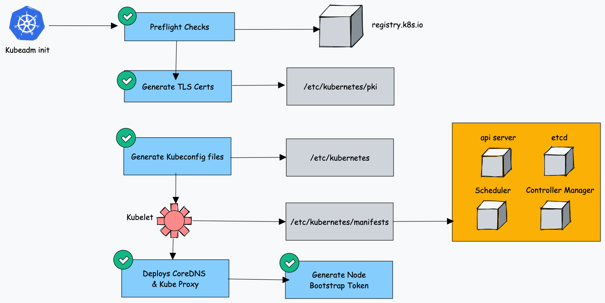
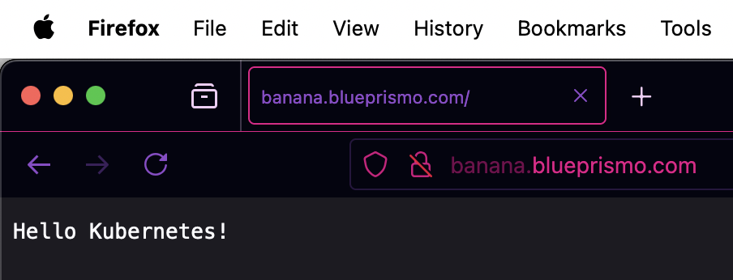

# Intro

In this post I am going to explain some basics about kubernetes and set up a cluster in a quick manner.
For this purpose I will use `kubeadm`, `kubectl` and `kubelet`. As this approach provides a more realistic production environment.
There are other tools like `microk8s`, `k3s` or `kind`, but IMO quite simplistic.
I will use Kubernetes v1.31.0 as it's the latest one (released: 2024-08-13)

## Prerequisites

- Pre existing (minimum 2cpu) instance from any cloud provider or even own machine.
- `kubectl`, `kubeadm` and `kubelet` installed
  - kubeadm: the command to bootstrap the cluster.  
  - kubelet: the component that runs on all of the machines in your cluster and does things like starting pods and containers.  
  - kubectl: the command line util to talk to your cluster.  
- A container runtime (I have `containerd` as `/var/run/containerd/containerd.sock` is present :smile: )
- Disable swap memory as the default behaviour of kubelet will fail to start if swap is detected on a node: `sudo swapoff -a`
- At least one cgroup driver like `cgroupfs` or `systemd`. Usually systemd comes as the init system of ubuntu/debian distros, you can check that with `ps -p 1 -o comm=`. In my case I use systemd.
- (Optional) - [Configure a cgroup driver](https://kubernetes.io/docs/setup/production-environment/container-runtimes/)
- By default, the Linux kernel does not allow IPv4 packets to be routed between interfaces. Ensure you have port forwarding enabled. You can do so permanently by:

```bash
# sysctl params required by setup, params persist across reboots
cat <<EOF | sudo tee /etc/sysctl.d/k8s.conf
net.ipv4.ip_forward = 1
EOF 
```

- Start kubelet `sudo systemctl enable --now kubelet` this will be on a crashloop as it will wait for kubeadm to tell it what to do.
- If using `containerd` as container runtime, enable the CRI (Container Runtime Interface) plugin `sed 's/\"cri\"//g' -i /etc/containerd/config.toml  && sudo systemctl restart containerd`

:warning: **Matching the container runtime and kubelet cgroup drivers is required or otherwise the kubelet process will fail** :warning:

## Theory

### Bootstraping steps

The main goal is to initialize a cluster, with `kubeadm init` the following happens:



1. When you initialize kubeadm, first it runs all the preflight checks to validate the system state and it downloads all the required cluster container images from the **registry.k8s.io** container registry.
2. It then generates required TLS certificates and stores them in the **/etc/kubernetes/pki** folder.
3. Next, it generates all the kubeconfig files for the cluster components in the **/etc/kubernetes** folder.
4. Then it starts the kubelet service and generates the static pod manifests for all the cluster components and saves it in the **/etc/kubernetes/manifests** folder.
5. Next, it starts all the control plane components from the static pod manifests.
6. Then it installs core DNS and Kubeproxy components
7. Finally, it generates the node bootstrap token.
8. Worker nodes use this token to join the control plane.

You can also pull the images previously for a faster boostrapping phase.
Our goal with this step is to have the `etcd`, `api-server`, `scheduler` and `controller-manager` pods ready, and the `core-dns` ones waiting for a Pod Network plugin.

### Pod Network Plugin

For pods to be able to communicate with each other, we need a Network plugin, ideally from [this list](https://kubernetes.io/docs/concepts/cluster-administration/addons/#networking-and-network-policy).
There is an awesome lecture you can find in: <https://mvallim.github.io/kubernetes-under-the-hood/documentation/kube-flannel.html>

We need a CNI based Pod network add on otherwise Cluster DNS (CoreDNS) will not start up before a network is installed.

We have to ensure there is no network overlapping. You can check your server's networking configuration with `ip addr show`. For this example's demonstration I want the pod's network range to be `10.244.0.0/16`, as it's the default for the Flannel plugin I will use.

We can advertise our pod network range with kubeadm passing the flag  `--pod-network-cidr`.

If we have a public IP, let's protect it with `iptables`. We will allow only traffic from localhost to the exposed control-plane port (6443 default), we can do so by running:

```sh
iptables -A INPUT -p tcp -s localhost,$external_ip --dport 6443 -j ACCEPT
iptables -A INPUT -p tcp -s 10.244.0.0/16 --dport 6443 -j ACCEPT
iptables -A INPUT -p tcp --dport 6443 -j DROP
```

## Hands on

For this demonstration purposes, we will run all commands as root!

### Bootstrapping

After running `kubeadm init --pod-network-cidr 10.244.0.0/16` we should have a message that says
> Your Kubernetes control-plane has initialized successfully!

We will reference our KUBECONFIG file for kubectl to be able to interact with the Kubernetes API
`export KUBECONFIG=/etc/kubernetes/admin.conf`

This means our bootstapping in the picture has been done. Make sure you have all the containers running except the coredns ones. coredns ones are waiting for you to connect a Pod Network plugin!

```bash
$ kubectl get pods -n kube-system
NAMESPACE     NAME                            READY   STATUS    RESTARTS   AGE
kube-system   coredns-6f6b679f8f-4dj2d        0/1     Pending   0          80s
kube-system   coredns-6f6b679f8f-wrq6k        0/1     Pending   0          80s
kube-system   etcd-enini                      1/1     Running   40         86s
kube-system   kube-apiserver-enini            1/1     Running   45         86s
kube-system   kube-controller-manager-enini   1/1     Running   0          87s
kube-system   kube-proxy-xtrrb                1/1     Running   0          80s
kube-system   kube-scheduler-enini            1/1     Running   51         84s
```

If this is not your state, please check all the pre-requisites again and check that your container runtime is properly set! if you are using "containerd" you may have to run `containerd config default > /etc/containerd/config.toml`

### Deploy a Container Network Interface (CNI) based Pod network add-on

We need this in order for pods to communicate between each other.
As we set the CIDR the default for use with flannel, we just apply the kube-flannel.yml manifest:
`kubectl apply -f https://github.com/flannel-io/flannel/releases/latest/download/kube-flannel.yml`

After applying the flannel plugin, we can see the pods that have been deployed:

```sh
❯ kubectl get pods --all-namespaces
NAMESPACE      NAME                            READY   STATUS              RESTARTS   AGE
kube-flannel   kube-flannel-ds-wqbmj           1/1     Running             0          12s
kube-system    coredns-6f6b679f8f-4dj2d        0/1     ContainerCreating   0          117s
kube-system    coredns-6f6b679f8f-wrq6k        0/1     ContainerCreating   0          117s
kube-system    etcd-enini                      1/1     Running             40         2m3s
kube-system    kube-apiserver-enini            1/1     Running             45         2m3s
kube-system    kube-controller-manager-enini   1/1     Running             0          2m4s
kube-system    kube-proxy-xtrrb                1/1     Running             0          117s
kube-system    kube-scheduler-enini            1/1     Running             51         2m1s
```

The namespace `kube-flannel` will deploy a virtual interface called "flannel.1" as you can see with `ip a show flannel.1`, note that the interface will have the ip address of the default gateway for the pod network CIDR we've specified (the address will be 10.244.0.0/32)!

Let's spawn a new node and join it as a worker node. We can use another server we have, clone our server, etc.
It is important (and obvious) that the second server is also having a container runtime, `kubectl`,`kubeadm`,`kubelet` and all the same prerequisites as the previous master node.

### Adding a node

For the forgetful ones, you can see the join token via `kubeadm token create --print-join-command`. This way you will receive the working token to join your cluster (be aware those tokens expire after 24 hours!)

When you issue the `kubeadm join ...` command succesfully, you can go back to the master node and see the nodes:

```sh
❯ kubectl get nodes
NAME      STATUS   ROLES           AGE   VERSION
enini     Ready    control-plane   27m   v1.31.0
server2   Ready    <none>          74s   v1.31.0
```

By default the control-plane nodes (enini in the example) will not schedule new pods for security reasons. If you describe the node, you will see the `node-role.kubernetes.io/control-plane:NoSchedule` annotation that is in charge of that. If you please you can remove it of course!

### Now let's add a load balancer

Of course we will use [MetalLB](https://metallb.universe.tf/), as we're setting a test cluster for demo purposes
> MetalLB is a load-balancer implementation for bare metal Kubernetes clusters, using standard routing protocols.

The main reason is the ease of use, as we are going to deploy MetalLB in Layer2 mode [from the OSI model: this is the Data Link Layer (MAC addresses)], it uses ARP for IPv4 and NDP for IPv6 to advertise the addresses of services to the local network.

When a service in Kubernetes needs an external IP MetalLB responds to ARP requests from other devices on the network saying "I am the owner of this IP!". It will work on **ANY** ethernet network without any special hardware required.  
Layer 2 mode has two main limitations you should be aware of:

1. Single-node bottlenecking
2. Potentially slow failover.  

But as we're having fun, we couldn't care less about it (don't try this in prod pls).

Because we've used flannel, and you should do the same if you have installed any pod network addon except `kube-router`. We need to enable strict ARP mode, for the reasons I explained in the previous paragraph :smile: :

```sh
## MASTER NODE
# apply the changes, returns nonzero returncode on errors only
kubectl get configmap kube-proxy -n kube-system -o yaml | \
sed -e "s/strictARP: false/strictARP: true/" | \
kubectl apply -f - -n kube-system
```

Ready to install! Let's get helm and add the metallb repository:

```sh
## MASTER NODE
curl https://raw.githubusercontent.com/helm/helm/main/scripts/get-helm-3 | bash
helm repo add metallb https://metallb.github.io/metallb
helm repo update
helm install metallb metallb/metallb -n metallb-system --create-namespace
```

Be aware that you may need to remove the validating webhook, this may be necessary if you had resetted your flannel links set with iproute.

```sh
kubectl delete validatingwebhookconfigurations.admissionregistration.k8s.io metallb-webhook-configuration
```

After installing, let's create a little yaml file for the vaules to install:

```yaml
## metallb.yaml
---
apiVersion: metallb.io/v1beta1
kind: IPAddressPool
metadata:
  name: test-pool
  namespace: metallb-system
spec:
  addresses:
  - X.X.X.X/32
  - 37.27.33.117/32

---
apiVersion: metallb.io/v1beta1
kind: L2Advertisement
metadata:
  name: test
  namespace: metallb-system
```

And `kubectl apply -f metallb.yaml`

We will see that the metallb-controller and metallb-speaker are running. At this point, we could access our kubernetes services by it's public-facing IPs, but what's the point on that? It is much better to use ingresses! For this reason we are going to deploy the Ingress controller. Which will act as our gateway for the kubernetes microservices.
`helm install nginx --create-namespace -n nginx-ingress oci://ghcr.io/nginxinc/charts/nginx-ingress --version 1.3.2`

### Deploy a simple app

We can use the sample "hello Kubernetes" docker image from GCR.
It's just a dummy http server responding the quote above. But for demonstration's sake will suffice.

```yaml
---
apiVersion: apps/v1
kind: Deployment
metadata:
  name: hello-world
  labels:
    app: hello-world
spec:
  replicas: 1
  selector:
    matchLabels:
      app: hello-world
  template:
    metadata:
      labels:
        app: hello-world
    spec:
      containers:
      - name: hello-world
        image: gcr.io/google-samples/node-hello:1.0
        ports:
        - containerPort: 8080
---
apiVersion: v1
kind: Service
metadata:
  name: hello-world
spec:
  ports:
  - port: 80
    targetPort: 80
  selector:
    app: hello-world
  type: LoadBalancer  ## This is important!! As metallb listens for the `type = LoadBalancer` spec
---
apiVersion: networking.k8s.io/v1
kind: Ingress
metadata:
  name: hello-world
  annotations:
spec:
  ingressClassName: nginx
  rules:
  - host: myk8sserver.com
    http:
      paths:
      - pathType: Prefix
        path: "/"
        backend:
          service:
            name: hello-world
            port:
              number: 80
```

After deploying this simple app, we can head over the metallb-controller logs and we will see the assignment of the pubic IP of one node:

```json
{"caller":"service.go:150","event":"ipAllocated","ip":["37.27.33.117"],"level":"info","msg":"IP address assigned by controller","ts":"2024-08-25T13:49:39Z"}
{"level":"debug","ts":"2024-08-25T13:49:39Z","logger":"events","msg":"Assigned IP [\"37.27.33.117\"]","type":"Normal","object":{"kind":"Service","namespace":"default","name":"hello-world","uid":"8d7f85c1-4650-4532-88c0-185e594f8520","apiVersion":"v1","resourceVersion":"23808"},"reason":"IPAllocated","stacktrace":"sigs.k8s.io/controller-runtime/pkg/internal/recorder.(*Provider).getBroadcaster.func1.1\n\t/go/pkg/mod/sigs.k8s.io/controller-runtime@v0.18.4/pkg/internal/recorder/recorder.go:104\nk8s.io/client-go/tools/record.(*eventBroadcasterImpl).StartEventWatcher.func1\n\t/go/pkg/mod/k8s.io/client-go@v0.30.2/tools/record/event.go:414"}
{"caller":"main.go:116","event":"serviceUpdated","level":"info","msg":"updated service object","ts":"2024-08-25T13:49:39Z"}
{"caller":"main.go:117","event":"endUpdate","level":"debug","msg":"end of service update","ts":"2024-08-25T13:49:39Z"}
{"caller":"service_controller.go:115","controller":"ServiceReconciler","end reconcile":"default/hello-world","level":"info","ts":"2024-08-25T13:49:39Z"}
```

Remember to make sure the allocated IP address is referenced with the DNS record you have!



And this is how you could set up a very mediocre kubernetes set application just for the fun's sake.

## Recap

This was one way to see the core components in the kubernetes environment. In a nutshell they are:

1. kube-apiserver: The core component server that exposes the Kubernetes HTTP API
2. etcd: Consistent and highly-available key value store for all API server data
3. kube-scheduler: Looks for Pods not yet bound to a node, and assigns each Pod to a suitable node.
4. kube-controller-manager: Runs controllers to implement Kubernetes API behavior.
5. kubelet: service in each node that ensures that pods and their containers are running.
6. POD Network addon: For our pods to be able to talk to each other, in this case Flannel, but could be other ones like [calico](https://www.tigera.io/project-calico/)

We also see that the ingresses are about to have one successor: [Gateway API](https://gateway-api.sigs.k8s.io/), which I may post in the future about.
