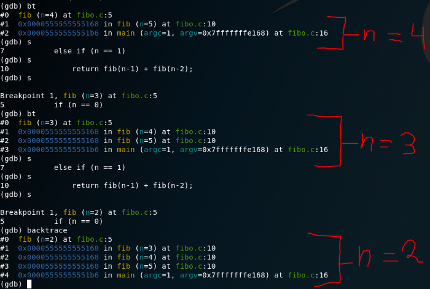

# Fibonacci serie teardown


First, we got a little recursive function, such as the famous fibonacci serie.
As we may know, fibonacci sequence has a couple of initial conditions, firstly the number 1 and 0 are meet, and if it’s a number other than these two, just calculate the function with the formula fib(n-1) + fib(n-2).
Here’s the brief C code:

```
    #include <stdio.h>

    int fib(int n)
    {
    if (n == 0)
    return 0;
    else if (n == 1)
    return 1;
    else
    return fib(n-1) + fib(n-2);
    }

    int main (int argc, char *argv[]){
    int n = 5;
    printf(“Calculating fibonacci of number %d\n”,n);
    printf(“%d\n”, fib(n));
    return 0;
    }

```

For the moment, quite easy to understand. Let’s compile it with the command:”gcc -g -o fibonacci <nameoftheCfile.c>” Once we got it, let’s examine what’s inside there. Execute the command “gdb ./fibonacci”, let’s begin with the debugging.

## Inside GDB

Let’s put a Breakpoint in line number 5, to do so, just type “b 5” or “break 5”, and begin to run the program with the command “run”.


As we can see in the picture, the program runs just until it hits that breakpoint we stablished before. If we execute the command bt we can see two ‘#’ indicating the number of stack frames we are dealing with. But what are stack frames?

>A stack frame is a frame of data that gets pushed onto the stack. In the case of a call stack, a stack frame would represent a function call and its argument data

So we can see the stack frame #1 which is the main function, and the stack frame #0 which is the fib function. Easy right? let’s step ahead with the s command (quite self-explanatory!) until we hit the breakpoint once again (that’s the thing with recursive functions). There we can see that a new stack frame has appeared,which is fib(n=4). As we know, we should expect the n=3, and n=2. Just repeat the same process untill we hit the fib(n=2).

Now we see fib(n=2) and all 5 stack frames, but how do we know fib(2) comes from fib(3) and not from fib(4) ??? To prove it let’s do an info frame 0, 1 and 2 to check the return address.


As we can see, the frame is called by de last one, we can see that the address of the frame 0x7fffffffe000 [which is the stack frame #1 -> fib(n=3)] is called in the stack frame #0 [which is fib(n=2) and has the stack frame at address 0x7ffffffffdfd0]. In other simple words, fib(2) was called by fib(3).


If we carry on with the execution and keep checking the stack then we will see that fib(2) will call fib(1). At this point fib(1) will hit the base condition and return and the second part of the return statement in fib(2) (return fib(1) + fib(0) ) will be called which is fib(0).


now that we’ve gone all down the recursion, the values come back to each frame call. fib(2) has been calculated which was required for fib(3) which was required for fib(4) which was required from fib(5).
Quite long explanation, but easy to view!
