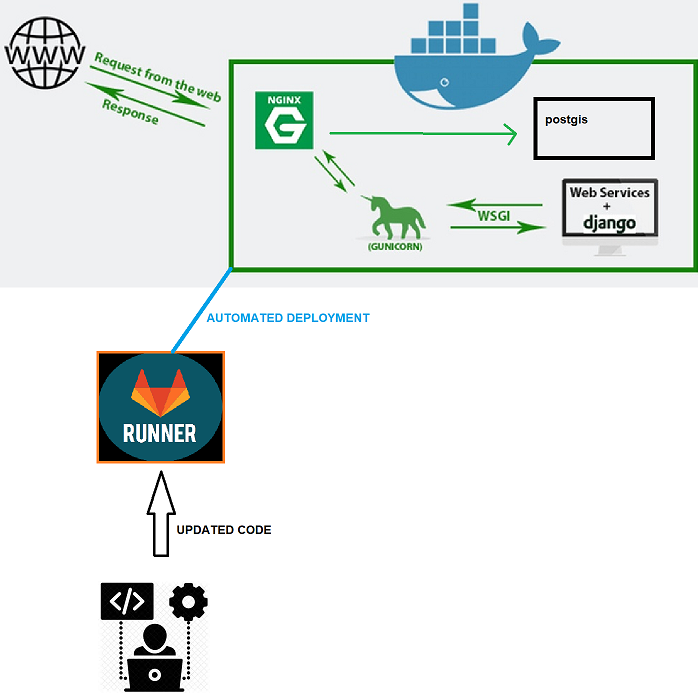

# Continuous Integration
Yeah, we hear a lot about devops and automation, etc. It's indeed cool worrying the minimum in the deployment of an architecture. So let's tamper and put a little project with few components with docker.
The scheme arquitecture we're going to have is something like this:



Let me describe it's components:

***NGINX**: Acts as a front-end reverse proxy, it will forward all the external requests to our internal application (database or django+gunicorn).

***DJANGO**: Out django + Gunicorn app, just a simple api. 

***POSTGIS**: Will be our database container, it's postgres with some geographic module, that's all.  

***RUNNER(s)**: It is a gitlab component to automate the deployments. It can be substituted with other solutions (like Jenkins for example). [Here's more information about Gitlab-runners](https://docs.gitlab.com/runner/)

We will start passing our monolithic apps to docker containers.

### First, let's set our angular Dockerfile  

we will have a multi-stage dockerfile, what's that??
In a nutshell, is a new way to optimize the old times whenever your app needed to be dockerized in multiple Dockerfiles and linked with some kind of scripts. Now (since Docker 17.05) you can part from multiple base images within a single dockerfile! if you are curious and feel like you need more information [you can check the official documentation](https://docs.docker.com/develop/develop-images/multistage-build/)
Our Angular-Dockerfile will be something like this:

```
#############
### build ###
#############
# base image
FROM node:12.2.0 as build
# install chrome i tests protractor
RUN wget -q -O - https://dl-ssl.google.com/linux/linux_signing_key.pub | apt-key add -
RUN sh -c 'echo "deb [arch=amd64] http://dl.google.com/linux/chrome/deb/ stable main" \
	 >> /etc/apt/sources.list
RUN apt-get update && apt-get install -yq google-chrome-stable
# set workdir
WORKDIR /var/www/windtec
# add `/app/node_modules/.bin` to $PATH
ENV PATH /var/www/windtec/node_modules/.bin:$PATH
# install + cache dependencies
COPY ./viewer /var/www/windtec
RUN npm install
RUN npm install -g @angular/cli
# generate build
RUN ng build --output-path=dist

##################
### production ###
##################

# base image
# more info at https://hub.docker.com/_/nginx
FROM nginx:mainline-alpine
# copy the  build component from the image above
COPY --from=build /var/www/windtec/dist /usr/share/nginx/html
# expose port 80
EXPOSE 80
# run nginx
CMD ["nginx", "-g", "daemon off;"]
```
I will push the generated image to a custom docker repository I have.

### Django (sort of backend)
Then I repeat this process but now with our django app, the Dockerfile will be as it follows:
```
FROM python:3-buster
ENV PYTHONUNBUFFERED 1
ENV LANG C.UTF-8
RUN mkdir /opt/project
WORKDIR /opt/project
COPY . .
RUN chmod +x ./pre_install.sh
RUN ./pre_install.sh
RUN chmod +x ./scripts_django/*
ENV PATH="/opt/project/scripts_django:${PATH}"
RUN mkdir -p /vol/web/media
RUN mkdir -p /vol/web/static

CMD ["entrypoint_django.sh"]
```
For the curious, this entrypoint can be translated to  "gunicorn --bind 0.0.0.0:8000 windtec.wsgi".
It just launches a service listening at port 8000. 
Once we've build and pushed the image into the docker repository, we can create a docker-compose file.

### Postgis
We will take the official postgis image from de public docker repository. Won't need to change a lot of things, just some configuration that will be overridden by a volume.

----

### Getting it all together
For this setup, i will use the angular image(which has nginx) to serve the angular content and proxy the requests to the python application.
Let's create our docker-compose file.

```yaml
version: '3.3'

services:
  nginx:
    container_name: nginx
    image: dockerhub.xxx.com/angular-windtec:dev	
#private repository, don't want to show you ;)
    ports:
      - "443:443" 	#we will use HTTPS
    volumes:
      - /usr/nexus/docker/windtec/angular/ngx_enabled:/etc/nginx/conf.d  
# configs with the reverse-proxy structure
      - /usr/nexus/docker/windtec/ssl:/etc/nginx/ssl 
# certificates

  windtec:
    container_name: windtec
    image: dockerhub.xxx.com/django-windtec:dev
    environment:
	# here would be user, pwd, etc.etc. whatever u want!
    ports:
      - "8000:8000"
    volumes:
      - ./webservice:/opt/project
    command: "python3 manage.py runserver 0.0.0.0:8000"
    depends_on:
      - db
  db:
    image: kartoza/postgis
    container_name: windtec_db
    environment:
    ports:
      - "25432:5432"
    volumes:
      - db_postgis_vol:/var/lib/postgresql

volumes:
  db_postgis_vol:

```
For simplicity's sake, i've just deleted the environmental variables. Actually, the only ports we will be exposing are the 443.
The windtec and postgis containers will get the requests forwarded by the nginx that acts as a reverse-proxy. Inside the docker network they will see each other. I will just keep those ports for local debugging (just in case), I'm just tampering around, remember that if you are going to deploy something in production, expose JUST the ports you need to expose.
So, just start it with a simple:
```
docker-compose up -d
```
And we've got out application deployed, but what if our code is updated? 
The gitlab-runner part is the last piece of our puzzle.

### Continuous integration: Gitlab Runner
As you've read all the documentation about gitlab runners, now we're ready to set it up!
We will do it via the repository .gitlab-ci.yml file. This file should be in your root folder of the repository of your project.
Mine results as this:
```yaml
variables:
  WINDTEC_HOST: 192.168.0.54
  
stages:
  - deploy

deploy_develop:
  stage: deploy
  tags:
    - windtec
  environment:
    name: dev
  script:
    - ssh "$WINDTEC_USER"@"$WINDTEC_HOST" '$WORKSPACE/dev.sh'
    - ssh "$WINDTEC_USER"@"$WINDTEC_HOST" 'cd $WORKSPACE;docker-compose restart'
  only:
    - dev

```
We can add multiple stages, but for our simple environment we'll have just one deployment in the development environment.
I addedd some environmental variables via the gitlab UI. The gitlab-runner has ssh access to the $WINDTEC_HOST so we're all good to go!
I want to make enphasys with this "dev.sh" script. This script just re-builds the docker images with the new code that has been pushed
**IF ANY OF THE STEPS IN THE GITLAB-CI.YML FAILS, THE NEW CODE WON'T BE DEPLOYED!**

And that's all for today :)

Be happy
:blush:
