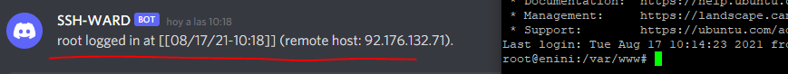
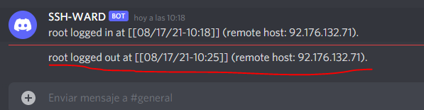

# SSH Guard
Today we are going to create a SSH guard, it is very usefull if you have a personal server.
Have you ever felt paranoid about your password / rsa-key being compromised by a third party?
Worry no more! With a discord bot and some PAM configuration tweaks you can feel more relaxed.


**_Side note: I've used discord, but you can use any app that you want as long as it supports webhooks (for example telegram)_**


# HANDS ON!

## Embrace the webhook
First we need a webhook, in a nutshell a webhook is some actuator that acts as an endpoint which will trigger a payload.
In this example, I will use a discord bot :robot:.

In order to do so create a server (or use a discord server you already have) then inside that server choose a channel and go to it's settings. There you will find the **"Integrations"** tab, click on **"Create new webhook"** and copy it as we will use it for later :wink:.

## Configure SSH in your linux server

Now we must tweak some ssh configuration and PAM behaviour, for more information about PAM you can read [this link](https://en.wikipedia.org/wiki/Linux_PAM)

Our approach requires to add an execution rule that will run a program every time a successful log in is done through SSH, in order to do so we must add this line to our **/etc/pam.d/sshd** file:

```bash
session   optional   pam_exec.so   /usr/local/sbin/sshd-login
```

You can see a comprehensive explanation about these arguments on pam.d(5), but the important thing to grasp is that session rules will trigger before an after a user is given service. 
The script I will execute thereafter is /usr/local/sbin/sshd-login.
Remember to create this file (if it doesn't exist in your server) and give it's appropiate permisions (I used 700)
The bash script should contain the following:
```bash
#!/bin/bash

WEBHOOK_URL="https://discord.com/api/webhooks/{{your custom webhook!!!!}}"

# Let's capture only open_session and close_session events (login and logout).
# more info @ http://www.linux-pam.org/Linux-PAM-html/sag-pam_exec.html
case "$PAM_TYPE" in
    open_session)
        PAYLOAD=" { \"content\": \" $PAM_USER logged in at [[`date +%D-%H:%M`]] (remote host: $PAM_RHOST).\" }"
        ;;
    close_session)
        PAYLOAD=" { \"content\": \" $PAM_USER logged out at [[`date +%D-%H:%M`]] (remote host: $PAM_RHOST).\" }"
        ;;
esac


# Let's only perform a request if there is an actual payload to send.
if [ -n "$PAYLOAD" ] ; then
    curl -X POST -H 'Content-Type: application/json' -d "$PAYLOAD" "$WEBHOOK_URL"
fi
```

You can tweak the date as you want (check the manual of date for that!). 

## Test it

Now, save the file and see if that works....
Just connect via ssh to your server and check if the webhook is triggered:



Perfect! Now also check the logout:
(remember to exit your terminal, not just close the window of your ssh-client)



Fine!
Simple as that, now you can forget about who logs in and out of your server .If you ever got a suspicious login, just check his IP with any geolocation tool available online such as [this one](https://www.iplocation.net/).

See you around!!! :smile: 
